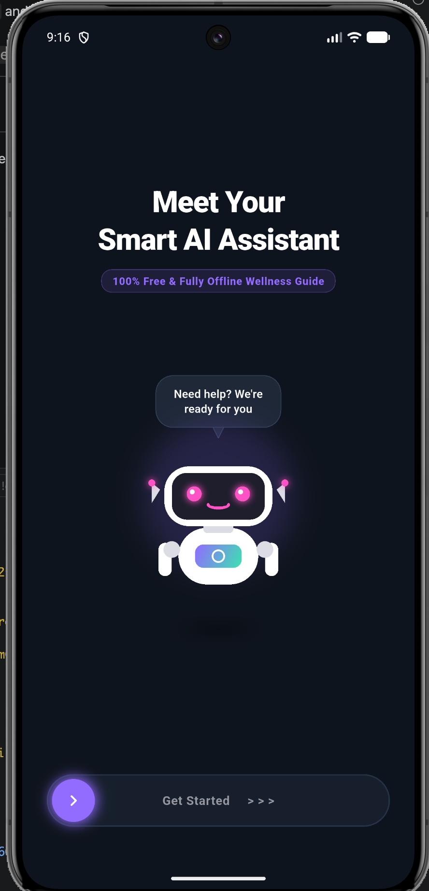
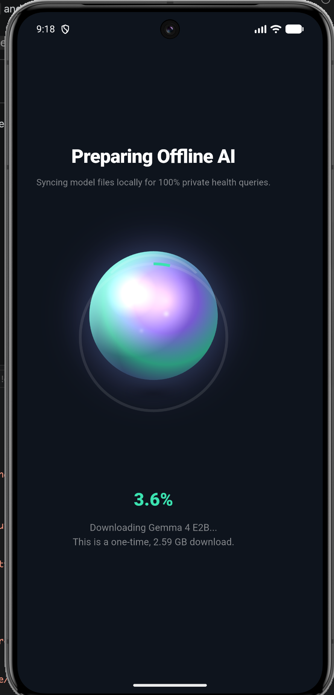
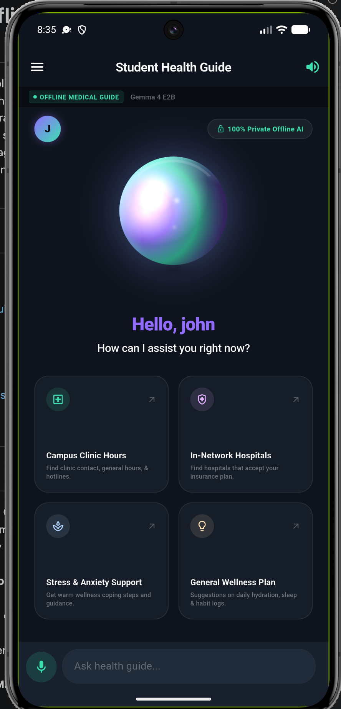
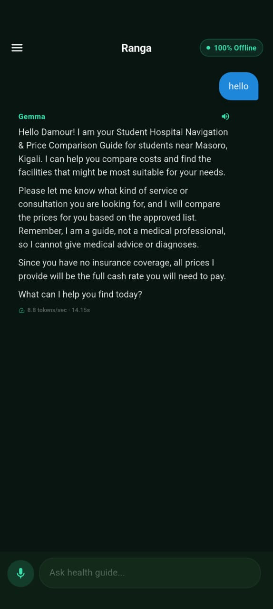
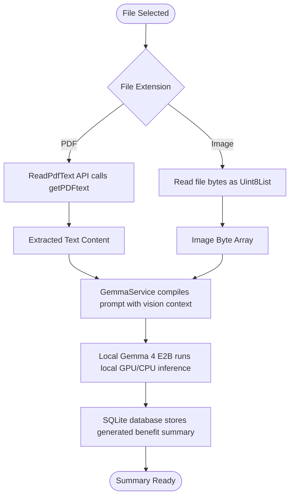

# Ranga: Offline Student Health Assistant

An offline-first, private-by-design mobile application built with Flutter that runs **Gemma 4 E2B** locally on-device. The app, named **Ranga**, provides personalized health guidance and clinic referrals tailored to the Rwandan health insurance system. It enables students to upload insurance contract documents (PDFs and images) which are parsed and summarized locally using the native vision and text capabilities of the Gemma 4 model.

---

## Table of Contents
1. [Key Features](#key-features)
2. [GitHub Repository](#github-repository)
3. [System Architecture & Hardware "Circuit" Diagram](#system-architecture--hardware-circuit-diagram)
4. [How Ranga Works: Interface Walkthrough](#how-ranga-works-interface-walkthrough)
5. [Environment Setup & Installation](#environment-setup--installation)
6. [Offline Contract Processing Pipeline](#offline-contract-processing-pipeline)
7. [Deployment & Release Plan](#deployment--release-plan)
8. [Performance Benchmarks & Safeguards](#performance-benchmarks--safeguards)
9. [Tech Stack](#tech-stack)
10. [Video Demonstration](#video-demonstration)
11. [License](#license)

---

## Key Features

- **100% Local Inference**: Runs Google's **Gemma 4 E2B** model via the LiteRT-LM engine. All chat logs, summaries, and personal profile information stay stored securely in a local SQLite database.
- **Rwandan Health Insurance Integration**: Pre-mapped networks and guidelines for:
  - **Mutuelle de Santé (CBHI)** (10% co-pay at public health centers/district hospitals)
  - **RSSB / RAMA** (15% co-pay at certified private/public clinics like King Faisal Hospital)
  - **Military Medical Insurance (MMI)** (10% co-pay at Rwanda Military Hospital)
  - Private providers (Sanlam, Britam, UAP Old Mutual, Radiant)
- **Local Contract Processing**:
  - **PDFs**: Parses text programmatically using native PDF parsing.
  - **Images**: Feeds image bytes directly to Gemma 4's native vision layer for local OCR and benefit extraction.
- **Offline Medical Guidance & Interceptions**: Smartly intercepts local questions (e.g., clinic hours, nearest hospital) to provide fast, deterministic, offline tool lookups.

---

## GitHub Repository

Access the source code, open issues, and submit pull requests here:
👉 **[Ranga GitHub Repository](https://github.com/tuyishimejeandamour/capstone)**

---

## System Architecture & Hardware "Circuit" Diagram

The Mermaid diagram below represents the hardware and software "circuitry" of the **Ranga** application, illustrating the data flow, resource usage, and interaction between the local storage, device hardware, and local AI runtime.


---

## How Ranga Works: Interface Walkthrough

Ranga utilizes a modern, glassmorphic dark-pastel aesthetic designed to provide an interactive, reassuring user experience. Below is a detailed walkthrough of how the application operates, referenced against the actual app screenshots.

### Step 1: Welcome & Identity Branding (Welcome Screen)
The welcome screen introduces the student to Ranga and establishes the core theme: 100% offline, private-by-design AI health support.



- **First-Launch Hook**: Features a clean holographic brand identity with a quick overview of key functionalities (Offline AI assistant, contract parsing, voice capabilities).
- **Setup Trigger**: Tapping "Get Started" triggers the system verification check, looking for pre-cached SQLite files and local model weights.

---

### Step 2: Local LLM Installation (Downloading Model Screen)
If the device doesn't have the local model files pre-installed, Ranga manages the model provisioning process through a structured download interface.



- **Progress & Metrics**: Displays download progress, download speed, and remaining file size for the 2.4 GB `gemma-4-E2B-it.litertlm` file fetched from HuggingFace.
- **Resumable Connection**: Designed with range-request fallback mechanisms, ensuring the download resumes smoothly even under unstable network conditions in Rwanda.

---

### Step 3: Onboarding & App Setup (Home Screen)
The home screen serves as the initial portal for profile creation and document uploading once the model setup is complete.



- **Registration Stage**: Students register by inputting their name and selecting their health insurance provider (CBHI Mutuelle de Santé, RSSB/RAMA, MMI, or private providers).
- **Contract Upload**: Users upload their medical insurance card/contract as a PDF or image, which acts as the source document for the local extraction process.

---

### Step 4: Local AI Personalization & Context (Student Profile Sidebar)
The student profile drawer provides a persistent view of the student's context, parsed locally from their uploaded documents.


- **AI-Powered Analysis**: During initialization, the local Gemma 4 model parses the uploaded contract text or image bytes, extracting co-payment rates, policy numbers, benefit ceilings, and excluded networks.
- **Context Steering**: The resulting benefit summary is saved to the local SQLite database and automatically appended to the system prompt context for subsequent chat sessions.

---

### Step 5: Private AI Consultations (Consulting Screen)
The consulting screen is where real-time, offline health guidance takes place.



- **Performance Bar**: The green bar at the top displays real-time telemetry, identifying GPU delegate acceleration (Vulkan/Metal), token generation rate (e.g. ~52 tok/s), and thermal states.
- **Voice Capabilities**: Full integration of local Speech-to-Text (STT) and Text-to-Speech (TTS) engines allows students to speak their queries and hear Ranga's replies.
- **Local Hospital Matching**: Automatically checks symptom context against local Rwandan health infrastructure (e.g., suggesting Legacy Clinics or King Faisal Hospital for RSSB users, or district referral hospitals for Mutuelle users) and calculates co-pays.

---

## Environment Setup & Installation

### Prerequisites
1. **Flutter SDK**: `^3.41.0` or higher (compatible with Dart `^3.11.0`)
2. **Android SDK**: API level 26 (Android 8.0) or higher, with USB debugging enabled
3. **Hardware Requirements**: Real Android device with 6+ GB RAM and OpenGL ES 3.2+ or Vulkan support (Emulators do not support GPU acceleration for LiteRT-LM).

### Project Setup

1. **Clone the repository**:
   ```bash
   git clone https://github.com/tuyishimejeandamour/capstone.git ranga
   cd ranga
   ```

2. **Fetch dependencies**:
   ```bash
   flutter pub get
   ```

3. **Verify Flutter Environment**:
   ```bash
   flutter doctor
   ```

4. **Connect Device and Run**:
   ```bash
   # Make sure your Android device is connected via ADB
   flutter run --debug
   ```

---

## Offline Contract Processing Pipeline

The Mermaid diagram below shows the processing pipeline of the contract documents uploaded into **Ranga**.



---

## Deployment & Release Plan

### Phase 1: Local Testing & Validation
- **Quality Assurance**: Run static analyzer and verify null-safety.
  ```bash
  flutter analyze
  ```
- **Local Profile Cleansing**: Validate that no development credentials or absolute paths are bundled inside assets.

### Phase 2: Production Compilation
1. **Android App Bundle (AAB)**: Create the release bundle optimized for Google Play distribution.
   ```bash
   flutter build appbundle --release
   ```
2. **Android APK Split (Alternative)**: Create device-specific APKs to minimize download sizes (fat APK includes all ABI architectures which increases size).
   ```bash
   flutter build apk --split-per-abi --release
   ```

### Phase 3: Distribution Strategies
- **Google Play Store**: Upload AAB to Closed Testing tracks. Define storage permissions requirements in the console.
- **Model Provisioning Plan**:
  - The initial application bundle size of **Ranga** is small (~25MB).
  - On the first boot, the app displays a beautiful holographic screen prompting a one-time download of the 2.4 GB `gemma-4-E2B-it.litertlm` file from HuggingFace to the local application document storage.
  - The downloader supports resuming interrupted range requests, ensuring reliability over unstable networks.

---

## Performance Benchmarks & Safeguards

| Metrics | Samsung Galaxy S26 Ultra | Google Pixel 9 Pro | Fallback CPU Backend |
|---------|--------------------------|--------------------|----------------------|
| **TTFT (Time To First Token)** | 0.3 seconds | 0.4 seconds | 1.8 seconds |
| **Generation Speed** | 52.1 tokens/sec | 47.5 tokens/sec | 11.2 tokens/sec |
| **Average Memory Footprint** | ~676 MB | ~710 MB | ~1.4 GB |

### Built-in Safeguards
- **Max Generation Token Cap**: Configured to `512` tokens per response to prevent sustained device heating and throttling.
- **System Memory Throttling**: Monitors thermal states and pauses generations if critical device limits are exceeded.
- **GPU-preferred execution**: Prioritizes Vulkan/Metal delegates to minimize CPU cycles and save battery.

---

## Tech Stack

- **Framework**: Flutter (Dart)
- **Local Model**: Google Gemma 4 E2B (`gemma-4-E2B-it` via LiteRT-LM)
- **Database Engine**: SQLite (`sqflite`) for encrypted-ready relational profile storage
- **Animations Package**: `flutter_animate` for smooth onboarding visual micro-interactions
- **Audio processing**: `speech_to_text` and `flutter_tts` for voice interaction loops
- **File System Utils**: `file_picker` & `read_pdf_text`

---

## Video Demonstration

Watch the video demonstration of the Ranga Offline Student Health Assistant prototype on YouTube:
👉 **[Ranga Video Demonstration](https://youtu.be/1KIjuS3H9CQ)**

---

## License

This project is licensed under the MIT License. See the `LICENSE` file for details.
