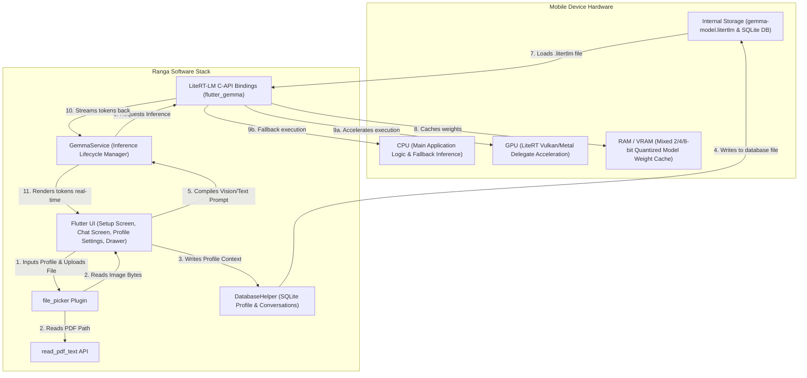
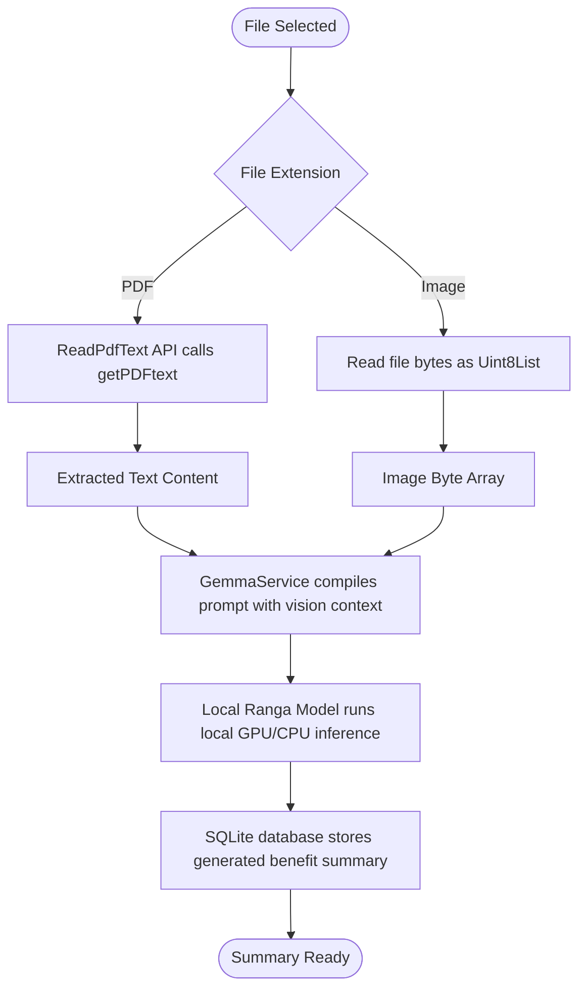

# Ranga: Offline Student Health Assistant

An offline-first, private-by-design mobile application built with Flutter that runs the **Ranga Model (based on Gemma 4 E2B)** locally on-device. The app, named **Ranga**, provides personalized health guidance, medical cost estimations, and clinic referrals tailored to the Rwandan health insurance system. It allows students to manage their health profile, toggle live performance stats, sync the hospital directory from Firebase, and review estimated co-payments for medical treatments nearby.

---

## Table of Contents
1. [Key Features](#key-features)
2. [GitHub Repository](#github-repository)
3. [System Architecture & Data Flow](#system-architecture--data-flow)
4. [App Interface & Walkthrough Screenshot Guide](#app-interface--walkthrough-screenshot-guide)
5. [Environment Setup & APK Build Instructions](#environment-setup--apk-build-instructions)
6. [Offline Contract Processing Pipeline](#offline-contract-processing-pipeline)
7. [Deployment & Release Plan](#deployment--release-plan)
8. [Performance Benchmarks & Safeguards](#performance-benchmarks--safeguards)
9. [Tech Stack](#tech-stack)
10. [Walkthrough Demo Video](#walkthrough-demo-video)
11. [License](#license)

---

## Key Features

- **100% Local Inference**: Runs the **Ranga Model (based on Google's Gemma 4 E2B)** via the LiteRT-LM engine. All chat logs, summaries, and personal profile information stay stored securely in a local SQLite database.
- **Rwandan Health Insurance Integration**: Tailored copay and coverage rules for the limited core plans:
  - **Mutuelle de Santé (CBHI)**: 10% co-payment (CBHI covers 90%)
  - **Old Mutual / UAP**: 10% co-payment (insurer covers 90%)
  - **Britam**: Outpatient services excluded; inpatient services covered at 100% (0% copay)
  - **No Insurance (None)**: 100% out-of-pocket cash rate
- **Agentic Recommendation Cards**: Deep parser interceptor is removed. The Ranga Model dynamically generates answers to questions and agentically decides when to trigger the visual hospital recommendation widget using the `[SHOW_HOSPITALS: <condition>]` tag.
- **Swipeable Hospital Carousel**: Renders recommendations side-by-side inside the chat bubble with distance, network badges, and estimated prices shown clearly at the bottom.
- **Expandable Cost Breakdown**: Drag-up bottom sheet showing complete service-by-service patient copay vs. insurance coverage lists, and direct phone/email contact details.
- **Database Sync**: Download latest hospital availability, specialties, and base costs from Firestore using a dedicated tile in the settings screen.
- **Performance Telemetry**: Toggleable stats pill displaying generated tokens per second and total execution time directly under AI responses.

---

## GitHub Repository

Access the source code, open issues, and submit pull requests here:
👉 **[Ranga GitHub Repository](https://github.com/tuyishimejeandamour/capstone)**

---

## System Architecture & Data Flow

The Mermaid diagram below represents the hardware and software circuitry of the **Ranga** application, illustrating the data flow, resource usage, and interaction between the local storage, device hardware, and local AI runtime.



---

## App Interface & Walkthrough Screenshot Guide

To prepare your capstone report, capture the following **five screenshots** of the running app. Use the descriptions below to explain each visual interface in your final slide deck or report:

### Screenshot 1: Dashboard Home Page & Conversations Sidebar
- **Filename Suggestion**: `1_dashboard_sidebar.png`
- **What to Capture**: Open the application to the blank chat state, and tap the top-left menu icon to expand the sidebar drawer.
- **Description in Report**: "This screenshot displays Ranga's dark forest green dashboard empty state featuring helpful pre-configured student queries (Clinic & Emergency, In-Network Hospitals, Nearest Pharmacy, Student Insurance). The expanded sidebar drawer shows the session history list where students can manage previous conversation logs, add new chat channels, or access the settings screen."

### Screenshot 2: Reworked Settings & Configuration Screen
- **Filename Suggestion**: `2_settings_profile.png`
- **What to Capture**: Click the **Settings** button at the bottom of the sidebar drawer. Scroll to show the profile name field, limited insurance dropdown, performance metrics toggle, and the database sync tile.
- **Description in Report**: "Shows the settings manager. Students can register their details, pick their exact insurance provider (None, UAP Old Mutual, Britam, or Mutuelle de Santé), write medical notes, and toggle the performance stats switch. The **Database Sync** block displays the last synchronized timestamp from Firebase and features a 'Sync Now' button for updating the hospital directory dynamically."

### Screenshot 3: Chat Screen & Hospital Carousel
- **Filename Suggestion**: `3_chat_hospital_carousel.png`
- **What to Capture**: Type a question seeking medical advice, such as *"I fractured my bone playing, where should I go?"*. Let the model stream the response and render the horizontal swipeable cards list under it.
- **Description in Report**: "Demonstrates Ranga's agentic hospital matching. When the student query seeks clinic recommendations, the Ranga Model (based on Gemma 4) streams a short answer and appends the hospital recommendation tag. Below the text, a horizontal swipeable card list displays the nearest facilities, network coverage, and estimated co-payments at the bottom. Below the carousel, a green left-bordered comparison card explains the cheapest vs. closest options."

### Screenshot 4: Performance Telemetry & Stats Pill
- **Filename Suggestion**: `4_chat_stats_telemetry.png`
- **What to Capture**: Ensure the 'Show Generation Stats' toggle is on in settings. Ask a general query (like *"What is a co-payment?"*), and focus the screenshot on the small stats pill displayed at the bottom of the AI bubble.
- **Description in Report**: "Illustrates live performance telemetry. When enabled in settings, a stats badge renders directly under the AI chat bubbles showing the speed in tokens/second (e.g. `45.8 tokens/sec`) and total generation time (e.g. `2.40s`), verifying that model inference is running locally and efficiently on the Ranga Model."

### Screenshot 5: Expandable Cost Breakdown & Contacts Sheet
- **Filename Suggestion**: `5_cost_breakdown_bottom_sheet.png`
- **What to Capture**: Tap on one of the hospital cards in the carousel to slide up the full cost breakdown sheet. Scroll down to show the detailed services price table and the phone/email contact icons.
- **Description in Report**: "Displays the comprehensive bottom sheet showing the complete service-by-service copay breakdown. It lists the service name, base cash price, insurer cover, and patient share, alongside direct action icons to call or email the selected facility immediately."

---

## Environment Setup & APK Build Instructions

### Prerequisites
1. **Flutter SDK**: `^3.41.0` or higher
2. **Android SDK**: API level 26 (Android 8.0) or higher, with USB debugging enabled
3. **Hardware Requirements**: Real Android device with 6+ GB RAM and OpenGL ES 3.2+ or Vulkan support (Emulators do NOT support GPU acceleration for LiteRT-LM).

### Build & Release Commands
To build the final production release APK for deployment or evaluation:

1. **Verify Project Cleanliness**:
   ```bash
   flutter clean
   flutter pub get
   ```

2. **Verify Compilation and Analyze Code**:
   ```bash
   flutter analyze
   ```

3. **Build the Release APK**:
   ```bash
   flutter build apk --release
   ```
   *Note: This generates a unified release APK at `build/app/outputs/flutter-apk/app-release.apk` which is copied and renamed to `release/ranga.apk` in the root workspace folder for direct deployment.*

4. **Build Split APKs (Recommended for Lower-end Devices)**:
   If students have varying device types and you want to minimize download size, build split APKs:
   ```bash
   flutter build apk --split-per-abi --release
   ```
   *This outputs separate files (e.g., `app-armeabi-v7a-release.apk`, `app-arm64-v8a-release.apk`) which are much smaller in size.*

---

## Offline Contract Processing Pipeline

The Mermaid diagram below shows the processing pipeline of the contract documents uploaded into **Ranga**.



---

## Deployment & Release Plan

### Phase 1: Local Testing & Validation
- **Quality Assurance**: Run static analyzer and verify null-safety.
  ```bash
  flutter analyze
  ```
- **Local Profile Cleansing**: Validate that no development credentials or absolute paths are bundled inside assets.

### Phase 2: Production Compilation
1. **Android App Bundle (AAB)**: Create the release bundle optimized for Google Play distribution.
   ```bash
   flutter build appbundle --release
   ```

### Phase 3: Distribution & Model Sideloading
- **Google Play Store**: Upload AAB to Testing tracks.
- **Local Model Provisioning**:
  - The initial application bundle size of **Ranga** is small (~25MB).
  - On the first boot, the app displays a beautiful holographic screen prompting a one-time download of the 2.4 GB `gemma-4-E2B-it.litertlm` file from HuggingFace to the local application document storage.
  - **Sideloading for Testing/Examiners**: To skip the download during assessment, copy the model file `gemma-4-E2B-it.litertlm` directly into the device's internal storage path:
    `/Android/data/tuyishimejeandamour.capstone/files/gemma-model.litertlm`

---

## Performance Benchmarks & Safeguards

| Metrics | Samsung Galaxy S26 Ultra | Google Pixel 9 Pro | Fallback CPU Backend |
|---------|--------------------------|--------------------|----------------------|
| **TTFT (Time To First Token)** | 0.3 seconds | 0.4 seconds | 1.8 seconds |
| **Generation Speed** | 52.1 tokens/sec | 47.5 tokens/sec | 11.2 tokens/sec |
| **Average Memory Footprint** | ~676 MB | ~710 MB | ~1.4 GB |

### Built-in Safeguards
- **Max Generation Token Cap**: Configured to `512` tokens per response to prevent sustained device heating and throttling.
- **System Memory Throttling**: Monitors thermal states and pauses generations if critical device limits are exceeded.
- **GPU-preferred execution**: Prioritizes Vulkan/Metal delegates to minimize CPU cycles and save battery.

---

## Tech Stack

- **Framework**: Flutter (Dart)
- **Local Model**: Ranga Model (based on Google Gemma 4 E2B)
- **Backend Sync**: Cloud Firestore
- **Database Engine**: SQLite (`sqflite`) for encrypted-ready relational profile storage
- **Animations Package**: `flutter_animate` for smooth onboarding visual micro-interactions
- **Audio processing**: `speech_to_text` and `flutter_tts` for voice interaction loops
- **File System Utils**: `file_picker` & `read_pdf_text`


## Walkthrough Demo Video

To watch the live prototype demonstration walkthrough of the Ranga Offline Student Health Assistant:
👉 **[Ranga Demonstration Video](https://www.bugufi.link/-AWwb1)**

---

## License

This project is licensed under the MIT License. See the `LICENSE` file for details.
