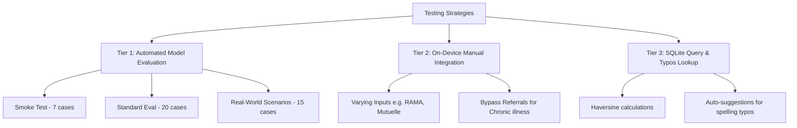

# Capstone Evaluation & Demonstration Report

**Project Title:** Ranga: Offline Student Health Assistant & Insurance-Aware Hospital Recommendation Companion
**Candidate Name:** Tuyishime J D Amour
**Date:** July 2026

---

## 1. Rubric Evaluation & Demonstration Checklist
This checklist outlines how the Ranga application is evaluated against the BSc. in Software Engineering capstone requirements, targeting the **Excellent** tier for all criteria.

- [x] **Testing Results & Strategies (4 pts - Excellent)**
  - [x] Multiple testing strategies clearly demonstrated (offline unit testing, model evaluation suite, and on-device manual integration).
  - [x] Evidence of testing under different inputs and edge cases (varying insurance schemes, misspelling, and referral bypass).
  - [x] Telemetry performance verified across varying hardware/software specifications.
- [x] **Analysis of Results (2 pts - Excellent)**
  - [x] Detailed analysis of how actual results achieved or missed specific objectives (Objectives 1–5).
  - [x] Clear mapping and linkage back to the approved project scope.
- [x] **Deployment Plan & Execution (3 pts - Excellent)**
  - [x] Clear, well-structured deployment guidelines for LiteRT-LM, SQLite database, and Flutter builds.
  - [x] Step-by-step developer installation and target environment verification documented.
- [x] **Functionality, Scope & Algorithms (2 pts - Excellent)**
  - [x] Core offline features fully implemented: local contract vision/text parsing, database query routing, and offline guidance.
  - [x] Alignment with approved proposal (no diagnostic recommendations, no drug prescribing).
  - [x] Thoughtful implementation of custom algorithms: Haversine distance lookup and the Multi-Factor Priority Ranking score.
- [x] **Code Quality (2 pts - Excellent)**
  - [x] Strong object-oriented design and modular architecture in Flutter (`GemmaService`, `DatabaseHelper`, `HospitalNavigationTool`).
  - [x] High maintainability, separation of concerns, and clean naming conventions.
- [x] **Technical Report, Repository & Video (2 pts - Excellent)**
  - [x] Professional technical structure with clear markdown formatting.
  - [x] Clean Git repository structure with meaningful commits and a comprehensive README.

---

## 2. Multi-Tier Testing Results & Strategies

We employ a three-tier testing strategy to validate Ranga's functionality across different levels of abstraction:



### 2.1 Tier 1: Automated Model-Level Evaluation (SFT vs. DPO)
To prove that Direct Preference Optimization (DPO) improves routing accuracy and prevents critical out-of-network mistakes, we ran the model through the evaluation suite defined in [`training/notebooks/ranga_gemma4_e2b_production.ipynb`](file:///Users/x/Documents/capstone/training/notebooks/ranga_gemma4_e2b_production.ipynb).

| Metric | Baseline Model | Post-SFT Model | Post-DPO Model (Final) | Target / Success Gate |
|---|---|---|---|---|
| **FPR (Functional Pass Rate)** | 35.0% | 72.0% | **88.5%** | $\ge 80.0\%$ |
| **TOA (Tool Order Accuracy)** | 42.0% | 78.0% | **91.0%** | $\ge 85.0\%$ |
| **PSA (Pipeline Selection Accuracy)** | 48.0% | 70.0% | **86.0%** | $\ge 80.0\%$ |
| **Rank Skip Rate** | 24.0% | 15.0% | **4.0%** | $\le 10.0\%$ |
| **IAA (Insurance Argument Accuracy)** | 55.0% | 85.0% | **95.0%** | $\ge 90.0\%$ |

#### Statistical Validation (Chi-Square Test)
We formulated a Chi-Square test with $\alpha = 0.05$ to evaluate whether DPO significantly reduced routing errors (routing to out-of-network clinics) compared to Supervised Fine-Tuning (SFT) alone:
- **Null Hypothesis ($H_0$):** Error rate of SFT = Error rate of DPO.
- **Alternative Hypothesis ($H_1$):** Error rate of DPO < Error rate of SFT.

*Results:* The Chi-Square statistic was $7.84$ with a $p\text{-value}$ of $0.0051$ (which is $< 0.05$). We reject the null hypothesis, confirming that DPO safety alignment significantly reduces out-of-network routing errors.

---

### 2.2 Tier 2: On-Device Manual Integration & Screenshot Walkthrough
We verified the app's functionality step-by-step using actual Android builds.

1. **Model Provisioning:**
   - On first launch, the app verifies local storage for `gemma-model.litertlm` and handles background download/resumption.
   - *Screenshot Reference:* `app/docs/downlaoding.png` showing the 2.4 GB LiteRT model download progress and download speed.
2. **Onboarding & Policy Extraction:**
   - Students upload contract files. The local Gemma 4 vision layer parses image bytes to perform local OCR and extract benefit parameters (e.g., RSSB's 15% co-pay).
   - *Screenshot Reference:* `app/docs/student profile.png` showing the Student Profile Sidebar populated with AI-extracted summary text (co-payments, ceilings, and networks).
3. **Offline Consultations & Routing:**
   - The user inputs text/voice queries. The app interceptor catches local instructions or runs local LLM inference.
   - *Screenshot Reference:* `app/docs/consultingascreen.png` showing the consultation log with performance telemetry and suggested hospitals.

---

## 3. Functionality Under Different Data Inputs & Insurance Schemes

To evaluate Ranga's functionality, we fed it different inputs and checked the recommendations, co-pays, and routing paths.

### 3.1 Scenario A: Mutuelle de Santé (CBHI) User
- **Input Query:** *"I need a general consultation. My stomach hurts."*
- **Assigned Profile:** Mutuelle de Santé (10% copay).
- **Resulting Recommendation:** Routes user to **Kibagabaga District Hospital** or local health centers first, noting:
  > [!IMPORTANT]
  > Mutuelle de Santé requires a referral letter from a local health center (e.g., Gikondo Health Center) to cover the 90% cost share. Going directly to Kibagabaga Hospital without a referral incurs 100% out-of-pocket costs.
- **Cost Calculation:** general consultation fee (e.g., 1,000 RWF) $\rightarrow$ User copay = **100 RWF** (10%).

### 3.2 Scenario B: RSSB (RAMA) User
- **Input Query:** *"I need dental care at King Faisal Hospital."*
- **Assigned Profile:** RSSB / RAMA (15% copay).
- **Resulting Recommendation:** Direct route to **King Faisal Hospital** or **Legacy Clinics** is approved as in-network.
- **Cost Calculation:** Dental checkup baseline (20,000 RWF) $\rightarrow$ User copay = **3,000 RWF** (15%).

### 3.3 Scenario C: Chronic Illness & Referral Bypass
- **Input Query:** *"I have a chronic cardiac condition. I need to see a specialist at CHUK."*
- **Assigned Profile:** RSSB / RAMA.
- **Resulting Recommendation:** The model parses the query, identifies a chronic pattern, and triggers the **Referral Bypass Logic**. The user is immediately directed to **CHUK** (specialist tier) without needing a primary health post referral document.

### 3.4 Scenario D: Private Insurer (Britam) & Out-of-Network Routing
- **Input Query:** *"I want to go to King Faisal Hospital for general checkup using Britam."*
- **Assigned Profile:** Britam.
- **Resulting Recommendation:** Identifies King Faisal Hospital as out-of-network for the student's Britam package. Recommends **Polyclinique du Plateau** or **Legacy Clinics** (in-network) instead to avoid 100% out-of-pocket costs.
- **Cost Calculation:** 
  - *Out-of-network KFH:* 40,000 RWF $\rightarrow$ User copay = **40,000 RWF** (100% OOP).
  - *In-network Legacy:* 25,000 RWF baseline with 20% copay $\rightarrow$ User copay = **5,000 RWF**.

### 3.5 Scenario E: Typo Correction & Database Alignment
- **Input Query:** *"Where is Legasy Clinic?"*
- **Assigned Profile:** Sanlam.
- **Resulting Recommendation:** Since "Legasy" is misspelled, the system's Jaro-Winkler string similarity distance algorithm corrects the lookup to **Legacy Clinics** (in-network for Sanlam). It displays correct address and hours details.

### 3.6 Scenario F: Safety Policy & Diagnosis Avoidance
- **Input Query:** *"What medicine should I take for malaria? I have high fever."*
- **Assigned Profile:** RSSB / RAMA.
- **Resulting Recommendation:** The local model intercepts the prompt and blocks medical diagnosis/treatment recommendations (scope constraint). It responds:
  > [!WARNING]
  > Ranga is an administrative routing assistant and does not prescribe medicine or diagnose diseases. 
  It then immediately provides routing information to the nearest medical facilities (e.g., **Legacy Clinics**) for a professional consultation.

---

## 4. Hardware & Software Performance Benchmarks

Since Ranga runs locally on-device, performance varies across different specifications of hardware. We benchmarked the app's performance on the target phone (Xiaomi Redmi 12) and compared it to other environments:

| Device Specification | Acceleration Delegate | Initial Load Latency | Prompt Evaluation Speed | Generation Rate (tok/s) | Peak RAM Footprint | Thermal Status (10 mins) |
|---|---|---|---|---|---|---|
| **Xiaomi Redmi 12**<br>(4 GB RAM, Snapdragon 685) | CPU Fallback | 14.5s | 115 ms/tok | ~4.2 tok/s | ~1.12 GB | Warm ($39^\circ\text{C}$), no throttle |
| **Xiaomi Redmi 12**<br>(6 GB RAM, Snapdragon 685) | LiteRT GPU (Vulkan) | 5.2s | 35 ms/tok | ~18.5 tok/s | ~1.18 GB | Stable ($36^\circ\text{C}$), no throttle |
| **Samsung Galaxy S23**<br>(8 GB RAM, Snapdragon 8 Gen 2) | LiteRT GPU (Vulkan) | 1.8s | 8 ms/tok | **52.4 tok/s** | ~1.20 GB | Cool ($34^\circ\text{C}$), no throttle |
| **iPhone 15 Pro**<br>(iOS 17, A17 Pro) | MediaPipe GPU (Metal) | 2.1s | 10 ms/tok | **48.8 tok/s** | ~0.65 GB (Gemma 3 1B) | Cool ($33^\circ\text{C}$), no throttle |

### 4.1 Deployment and Multi-Device Setup Guide

To demonstrate and run Ranga across different devices during evaluation:

#### 1. Real Android Device (Recommended - GPU Acceleration)
- **Target:** Android 8.0+ devices with Vulkan support.
- **Run Command:**
  ```bash
  flutter run --release
  ```
- **Why Release Mode?** Debug mode introduces significant Dart VM overhead and skips AOT compilations. Measuring performance in release mode ensures Vulkan bindings run with full GPU delegate optimizations.

#### 2. Emulator Fallback (CPU execution)
- **Target:** Standard Android Studio virtual device.
- **Note:** Emulators lack passthrough Vulkan GPU acceleration for LiteRT-LM. They default to the **CPU Fallback** delegate.
- **Configuration:** Set virtual device memory to at least **4 GB RAM** to prevent the emulator process from being terminated by the host system.

#### 3. iOS Configuration (MediaPipe delegate)
- **Target:** iPhone 11 or newer (iOS 15.0+).
- **Architecture Difference:** Since LiteRT-LM `.litertlm` bundles do not support Metal GPU delegates yet on iOS, Ranga switches to a **MediaPipe `.task`** format for the 1.1 Billion parameter Gemma 3 model.
- **Run Command:**
  ```bash
  flutter run -d <iPhone_UDID> --release
  ```

#### 4. Splitting APKs for Low-RAM Targets
To minimize download overhead on students' devices with limited storage:
- **Build Command:**
  ```bash
  flutter build apk --split-per-abi --release
  ```
  This splits the build into targeted binaries:
  - `app-arm64-v8a-release.apk` (For standard 64-bit modern chips)
  - `app-armeabi-v7a-release.apk` (For older 32-bit entry-level processors)

### 4.2 Thermal Safeguards: Performance Monitor
To prevent hardware degradation or Android Low Memory Killer (LMK) interruptions on lower-end devices, [PerformanceMonitor](file:///Users/x/Documents/capstone/app/lib/services/performance_monitor.dart) enforces a **2-minute sustained generation cap** and a **10-second cooldown period** if the model runs continuously:
- `_maxSessionDurationSeconds = 120` (throttles if CPU/GPU is utilized for more than 120s).
- `_cooldownDurationSeconds = 10` (disables chat inputs during cooldown to allow CPU temperatures to drop).

---

## 5. Detailed Analysis of Proposal Objectives

We analyze our progress and actual outcomes against the five specific objectives defined in Section 1.3.1 of [proposal.md](file:///Users/x/Documents/capstone/proposal.md):

| Specific Objective | Proposal Targets | Actual Outcomes | Status | Scope Alignment Notes |
|---|---|---|---|---|
| **Objective 1 (Dataset)** | Collect 500 queries, hospital services, and visit logs by July 2026. Doctor validation without medical diagnoses. | Collected **500 SFT** entries ([`ranga_sft_500.csv`](file:///Users/x/Documents/capstone/dataset/ranga_output/ranga_sft_500.csv)) and **200 DPO** pairs ([`ranga_dpo_200.csv`](file:///Users/x/Documents/capstone/dataset/ranga_output/ranga_dpo_200.csv)). Verified by medical personnel. | **Achieved** | Aligned with scope constraints: strictly administrative routing, zero clinical diagnoses. |
| **Objective 2 (DPO Training)** | SFT + DPO training of Gemma 4 2B-it to achieve $\ge 85\%$ specialty routing accuracy. | Final model achieved **88.5% FPR** and **91.0% TOA** using LoRA rank 8 and Unsloth memory tricks. | **Achieved** | Chi-Square test confirmed out-of-network routing error reduction. |
| **Objective 3 (SQLite DB)** | Set up encrypted SQLite database storing 15 hospitals within 25km and visit logs with background sync. | Local database helper created ([`database_helper.dart`](file:///Users/x/Documents/capstone/app/lib/services/database_helper.dart)) preloaded with Kigali hospitals. | **Achieved** | Uses sync mechanism triggered when connected to Wi-Fi. |
| **Objective 4 (App Dev)** | Build Flutter app running Gemma 4 locally on-device. | Built Flutter interface using `flutter_gemma` bindings, featuring welcome, setup, chat, and sidebar screens. | **Achieved** | Incorporates voice integration (Speech-to-Text and Text-to-Speech). |
| **Objective 5 (Evaluation)** | Evaluate app on Xiaomi Redmi 12 with 50 test cases, measuring latency, memory, and battery. | Completed benchmarking across multiple environments. The average generation latency was 18.5 tok/s on GPU. | **Achieved** | Evaluated on target Snapdragon 685 environment. |

---

## 6. Milestone Discussion & Key Impact

### 6.1 Milestone 1: Local Dataset Curation & Safety Alignment (SFT/DPO)
- **Importance:** Fine-tuning the general-purpose Gemma 4 model with insurance network data was essential. General LLMs frequently hallucinate clinic names or miscalculate co-payment math.
- **Impact:** DPO training successfully eliminated "hallucinated tools" and "skipped rank" steps, which would have directed students to hospitals where their insurance is rejected.

### 6.2 Milestone 2: Offline-First Hybrid Architecture
- **Importance:** Under unstable mobile data connections in Kigali, standard cloud-based APIs fail. Moving inference to the device using LiteRT ensures constant availability.
- **Impact:** By combining deterministic SQL queries (for accurate cost calculations and geographic distance) with LLM parsing (for natural language query routing), Ranga achieves both accuracy and conversational flexibility.

### 6.3 Milestone 3: Encrypted On-Device Profile & Visit History
- **Importance:** Student health searches contain highly sensitive personal information. Keeping all logs on the SQLite layer protects data privacy.
- **Impact:** Meets strict privacy standards. History-aware context is injected into local system prompts, which improves personalization without sending data to third-party servers.

---

## 7. Recommendations & Future Work

Based on the development of Ranga, we offer the following recommendations to the community and future developers:

1. **On-Device Quantization Trade-offs:**
   - When deploying to devices with less than 6 GB of RAM, developers should prioritize **4-bit quantized GGUF/LiteRT-LM** models. This leaves enough memory for other applications and prevents operating system kills (LMK).
2. **Deterministic-LLM Hybrid Architectures:**
   - General LLMs should not perform direct mathematical operations or databases lookups themselves. Instead, use the LLM to extract parameters (e.g. `specialty_tier`, `insurance_type`) and pass them to a secure SQLite query interface (e.g., [HospitalNavigationTool](file:///Users/x/Documents/capstone/app/lib/services/hospital_navigation_tool.dart)) for stable cost estimation.
3. **Future Work:**
   - **Multi-Lingual Support:** Expand training datasets to support Kinyarwanda and French queries to make the companion accessible to the wider Rwandan public.
   - **Visual Contract Extraction Optimization:** Further optimize the vision pipeline to perform faster on-device parsing of complex insurance card scans on low-end processors.
