# Ranga: An On-Device AI Insurance-Aware Hospital Recommendation Companion for the General Public

**BSc. in Software Engineering**

**Tuyishime J D Amour**

**Date: May 2026**

---

## Table of Contents

This proposal includes the following sections. First is the Abstract. Second is the List of Acronyms and Abbreviations. Third is Chapter One, which introduces the study. Fourth is Chapter Two, which reviews the literature. Fifth is Chapter Three, which covers system analysis and design. Sixth is Chapter Four, which discusses ethical considerations. Finally, the proposal lists the References.

---

## List of Acronyms/Abbreviations

| Acronym | Full Form |
|---------|-----------|
| AKS | Android Keystore System |
| ALU | African Leadership University |
| AI | Artificial Intelligence |
| AWQ | Activation-aware Weight Quantization |
| CBHI | Community-Based Health Insurance |
| DB | Database |
| DPO | Direct Preference Optimization |
| ERD | Entity Relationship Diagram |
| FAQ | Frequently Asked Questions |
| GGUF | GPT-Generated Unified Format (quantized model file format) |
| HBM | Health Belief Model |

| LLM | Large Language Model |
| LMK | Android Low Memory Killer |
| ML | Machine Learning |
| MOH | Ministry of Health |
| OOP | Out-of-Pocket (costs) |
| PEFT | Parameter-Efficient Fine-Tuning |
| RAM | Random Access Memory |
| RLHF | Reinforcement Learning from Human Feedback |
| RSSB | Rwanda Social Security Board |
| SFT | Supervised Fine-Tuning |
| SLM | Small Language Model |
| SOS | Save Our Souls (Emergency Signal) |
| TTS | Text-to-Speech |
| UI | User Interface |
| UML | Unified Modeling Language |
| UTAUT | Unified Theory of Acceptance and Use of Technology |
| UX | User Experience |

---

## Abstract

Many people in Kigali have physical health problems. When they get sick, they must find a hospital by themselves. They must also figure out a very hard insurance system. If they make a mistake, they must pay for their treatment with their own money (World Health Organization [WHO], 2022).

People use four different insurance plans. These plans are the RSSB scheme (Rwanda Social Security Board [RSSB], 2026a), the CBHI plan (RSSB, 2026b), Eden Care Medical plans (Eden Care Medical, 2026), and Britam Rwanda policies (Britam Rwanda, 2025). Each plan has different rules. Some plans require patients to get a referral letter first. Other plans require patients to go only to clinics in a special list. Some plans make patients pay a part of the bill. If a patient does not follow these rules, the insurance company will not pay the bill. In this case, the patient must pay the entire cost themselves (Nyandekwe et al., 2020). For example, CBHI makes patients pay ten percent of the bill. But if the patient goes directly to a hospital without a referral, the patient must pay the full bill themselves (Rwanda Ministry of Health [MOH], 2020).

This project proposes a new phone app called Ranga. The name comes from a Kinyarwanda word that means to show the right way. The app does not need the internet. Its main goal is to recommend hospitals based on insurance rules and track visit feedback. The app stores clinic details, insurance networks, and estimated costs for seven core medical services. The initial version of the app only uses English to process queries. We pilot the app with ALU Kigali students because they speak English as their primary language, which bypasses language translation issues. The app uses an offline-first design. It updates its database silently in the background when the phone connects to university Wi-Fi. This stops the app from sending users to closed or de-listed clinics.

The app runs on two AI models. The first model is Google's Gemma 4 E2B-it (Google DeepMind, 2026b). It has two billion parameters. It can listen to English voices directly. It does not need a separate speech-to-text model like Whisper-tiny. This makes the app use less phone memory. It also makes the app load faster. The model reads the user's voice and decides which medical specialty is needed. It checks if the user has a history of the same illness. If the user has a chronic illness, the app lets them skip the referral step. In this case, the app sends them to a specialized hospital. The app also estimates how much money they must pay. The second model is Kokoro-82M (Hexgrad, 2025). This model reads the recommendation aloud. The app loads these two models one after the other. It never loads them at the same time. This stops the phone from running out of memory.

We will evaluate the system using on-device simulations and fifty crafted voice query samples. We will test the model's accuracy in identifying clinic categories and routing queries. We will use a Chi-Square test with an alpha of five hundredths to prove that direct preference optimization reduces routing errors compared to supervised fine-tuning alone.

---

# CHAPTER ONE: INTRODUCTION

## 1.1 Introduction and Background

Managing health is a global problem. The World Health Organization (2022) states that one in seven young people has a mental health issue. In poor countries, it is very hard for people to get healthcare. In Rwanda, citizens face the challenge of managing complex insurance plans by themselves.

People in Rwanda use four different insurance plans. These plans are RSSB (RSSB, 2026a), CBHI (RSSB, 2026b), Eden Care Medical (Eden Care Medical, 2026), and Britam Rwanda (Britam Rwanda, 2025). Each plan has very different rules.

Public insurance includes RSSB and CBHI. These plans follow government rules for referrals (MOH, 2020). A patient must go to a local health post or small clinic first. Bypassing this step results in the patient paying the whole bill themselves (Nyandekwe et al., 2020). The CBHI plan helped lower personal medical spending in Rwanda from 26.59% to 11.67% of all health costs. However, patients must follow the referral rules to get this benefit (RSSB, 2026b).

Private insurance includes Eden Care and Britam. These plans use special networks of private clinics. The user must pay ten to twenty percent of the cost. They must also get approval before they see a specialist or go to a large hospital. If they go to an out-of-network facility, the insurance will not pay (Muremyi et al., 2023).

We put these rules into a Policy Routing Formula in Section 2.2.12. This formula helps the Cost Navigator calculate how much money a user will spend.

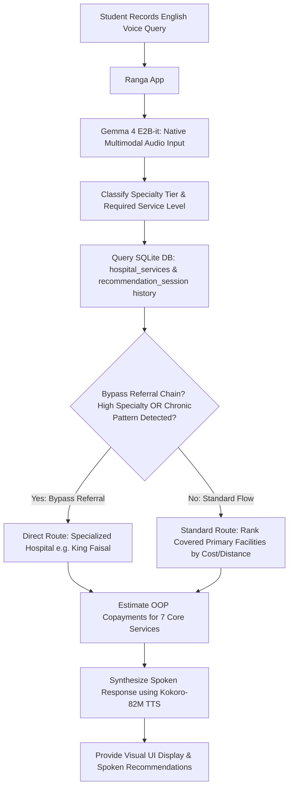

## 1.2 Problem Statement

The general public faces big financial risks. They often pay high medical bills because they make mistakes with their health insurance rules. Citizens use four main plans, which are RSSB, CBHI, Eden Care, and Britam. If a user skips their primary care clinic or goes to an out-of-network hospital, the insurance company will reject their claim. This makes the user pay the entire bill themselves (MOH, 2020; Muremyi et al., 2023). Right now, there is no tool that utilizes insurance network rules to recommend correct hospitals to the public and estimate out-of-pocket costs for specific services.

This problem has other parts. First, most health apps need the internet. They do not work when the internet is down. Second, general AI models are dangerous because they try to diagnose diseases or suggest medicines and medical devices. Third, offline databases can go out of date quickly when clinic networks change. This leads to routing mistakes. Because of this, users need a phone app that runs offline and updates in the background. The app must guide them to the right hospitals based on their history, insurance networks, and costs for 7 core services. It must do this without giving medical diagnoses, recommending medical devices, or prescribing medicine.

## 1.3 Project Objectives

The main goal of this project is to build a private, offline mobile app. The app will use a trained on-device language model. This app will help users choose the best hospitals based on their insurance policy. It will track clinic visits and feedback. It will also help them find the cheapest clinics and estimate their copayments for 7 core services. The project covers four insurance schemes and runs from June to October 2026.

### 1.3.1 Specific Objectives

The project has five specific goals. The first goal is to collect five hundred clinic queries, hospital services, insurance networks, and visit logs by July 2026. An insurance specialist will review this dataset. This dataset will not include any medical diagnoses, drug names, or medical device recommendations.

The second goal is to train the Gemma 4 E2B-it model using supervised fine-tuning and direct preference optimization by August 2026. The training aims to reach an accuracy of eighty-five percent or higher in specialty classification and provider recommendation. We will use a Chi-Square test with an alpha of five hundredths to prove that direct preference optimization reduces out-of-network routing mistakes.

The third goal is to build an encrypted SQLite database on the phone by August 2026. This database will store the 15 best Kigali hospitals in a 25-kilometer radius, their copayment rates for 7 core services, and past user visits. It will also use a background update plan that warns users if the data is old.

The fourth goal is to make a Flutter mobile app by September 2026. This app will load its two models one after the other. It will use Gemma 4 for voice input and Kokoro-82M for text-to-speech. The app will also include a query validation screen to fix accent mistakes and a list of hospitals sorted by cost.

The fifth goal is to evaluate the app using fifty crafted voice query samples by October 2026. We want to reach an average recommendation accuracy of eighty percent or higher. We also want to measure latency, memory usage, and battery consumption on the test phone.

### 1.3.2 Risk and Mitigation Matrix

| Objective | Identified Risk | Impact | Mitigation Strategy |
|---|---|---|---|
| First Objective (Dataset) | The specialist rejects more than twenty percent of the clinic queries. This would slow down the project. | High | We will start with three hundred standard query templates. We will only review two hundred custom queries manually. We will also ask an ALU staff member to help review. |
| Second Objective (DPO Training) | Direct preference optimization uses double the graphics memory. This might crash the Google Colab computer. | High | We will use Unsloth memory tricks. We will reduce the model rank to eight during training. We will also limit the model text memory to one thousand twenty-four tokens. |
| Fourth Objective (Deployment) | The phone might crash if it runs two AI models at the same time on a device with four gigabytes of memory. | Critical | We will load and unload each model one after the other. The app will never run Gemma 4 and Kokoro-82M at the same time. This keeps the memory usage low. |
| Fifth Objective (Evaluation) | The fifty crafted voice samples do not cover enough accent variations. | Medium | The researcher will craft and record fifty diverse voice samples representing different pronunciations and accents to evaluate the system. |
| All | The model might misunderstand user voices because of their regional accents. | High | We will show a validation screen if the model is not sure about a word. The app will ask the user to click the correct hospital name or type it. |

## 1.4 Research Questions

This project aims to answer four research questions.

The first question is about query classification and routing accuracy. How well does the on-device model classify user queries into correct specialty tiers? How well does it recommend the correct hospitals when users speak their queries? We will measure this as a percentage of correct recommendations on a fifty-case test set.

The second question is about history-aware interaction personalization. How much does using the user's history of past searches and visit feedback improve the recommendations? We will measure the difference using Jaccard Distance and Cosine Similarity. We will compare our app with a baseline model that does not save user history.

Cosine Similarity between two recommendation lists A and B is defined as:

```
CosineSimilarity(A, B) = (A . B) / (||A|| * ||B||)
```

A score close to 1.0 means the recommendations are identical and history did not change the output. The history system works if it lowers the average similarity score by at least fifteen hundredths compared to the baseline. This change proves the app gives personalized results based on past feedback.

The third question is about safety alignment. Does direct preference optimization significantly reduce serious insurance routing errors compared to supervised fine-tuning alone? We define an error as routing a user to an out-of-network clinic. We will test this difference using a Chi-Square test with an alpha of five hundredths. The null hypothesis states that the error rate of the supervised fine-tuning model is equal to the error rate of the direct preference optimization model. Rejecting this hypothesis proves that direct preference optimization makes the app safer.

The fourth question is about device performance and speech accuracy. What are the average response time, highest memory usage, battery drain, and voice recognition accuracy for East African accents when the app runs on a Xiaomi Redmi twelve phone? This phone has four gigabytes of memory and a Snapdragon six hundred eighty-five chip.

## 1.5 Project Scope

The project scope includes content, geography, and time.

For content scope, the app handles user insurance plan selection and visit feedback logs. The on-device Gemma 4 model classifies clinic queries. The app navigates four insurance schemes, which are RSSB, CBHI, Eden Care, and Britam. It classifies specialty tiers and uses history to decide if a user can bypass a referral. The app estimates copayments for 7 core services, which are General Consultation, Dental Care, Optical Care, Laboratory Tests, Pharmacy & Medication, Emergency Services, and Physical Therapy. It accepts spoken English and uses a validation screen to fix voice accent errors. It also includes an emergency SOS button that dials the mental health helpline at 114 or the ALU duty phone. The app operates offline and syncs in the background. The project does not include medical diagnosis, medical device recommendations, medicine prescriptions, billing, telemedicine, custom policy text parsing, or connections to hospital servers.

For geographical scope, we pilot the app with ALU Kigali students. We choose ALU students because they represent a diverse group that speaks English as their primary language. This ensures that language translation and speech recognition issues do not block our initial evaluation of the core insurance routing logic. The app database includes the 15 best hospitals within a twenty-five kilometer radius of the ALU Kigali campus in Kacyiru. This area covers the main clinics that university students visit.

For time scope, the project runs from May 2026 to October 2026. This period lasts twenty-two weeks. We collect data and train the model from May to July. We develop and evaluate the app from July to October.

## 1.6 Significance and Justification

This project is important for four main reasons.

First, the app protects users financially. Many people make mistakes when choosing clinics. These mistakes turn covered visits into expensive bills. The app shows copayment estimates before users leave home. This help makes health choices more affordable (Habimana et al., 2022).

Second, this research has global relevance. More than one billion people live in poor countries and use fragmented insurance systems. These people must follow complex provider network rules (World Health Organization [WHO], 2022). This app can serve as a template for other schools in East Africa.

Third, the app protects privacy. All user data stays on the phone. The app encrypts the data using AES-256 and the Android Keystore System. No personal information goes to external servers (Bene et al., 2024).

Fourth, this work contributes to edge AI research. It proves that a small two-billion parameter model can run locally on a cheap phone. It shows that compressed models can perform complex administrative routing tasks on-device (Nissen et al., 2025).

## 1.7 Research Budget

The estimated cost of this project is two hundred two USD. The money will buy Google Colab Pro for GPU training, Hugging Face Pro for hosting datasets, and a Xiaomi Redmi twelve evaluation phone. The developer will fund the entire project.

| Item | Description | Estimated Cost (USD) | Source |
|------|-------------|----------------------|--------|
| Google Colab Pro+ | Cloud GPU access for SFT and DPO training | $46.00 | Developer Funded |
| Hugging Face Pro | Model hosting and dataset versioning | $36.00 | Developer Funded |
| Android Evaluation Device | Xiaomi Redmi 12 (4 GB RAM, Snapdragon 685) | $120.00 | Developer Funded |
| **Total** | | **$202.00** | |

## 1.8 Research Timeline

The project timeline runs from May to October 2026.

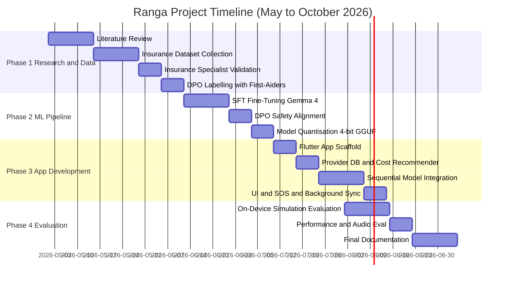

---

# CHAPTER TWO: LITERATURE REVIEW

## 2.1 Introduction

This chapter reviews academic literature across six areas. First, we look at theories about how people adopt new technology and manage their health. Second, we look at mobile health tools and insurance navigation apps. Third, we study speech errors and accent issues in voice health queries. Fourth, we review small language models and model compression. Fifth, we study safety training for insurance routing AI. Finally, we explore health insurance rules and medical costs in Rwanda. The review is organized by these topics. The research gap is described in Section 2.9.

## 2.2 Existing Digital Health Systems and Policy Logic

### 2.2.1 Ada Health

Ada Health is a symptoms app that runs in the cloud (Masanneck et al., 2024). It has two main problems. First, the developer documentation shows it does not run offline. Second, it does not support user query cost estimates. It does not save user interaction history. It also has no database of Kigali clinics or Rwandan insurance networks. It focuses on medical diagnosis instead of clinic routing. This creates safety risks.

### 2.2.2 Wysa

Wysa is a mental health chat app that runs in the cloud. It does not perform insurance routing or recommend clinics. It does not save user history or local clinic databases. Its privacy policy states that it processes all conversations on external servers. This makes it unsuitable for private local health administrative queries.

### 2.2.3 Babyl (Babylon Rwanda)

Babylon Health operated in Rwanda under the local name Babyl. This was a national telemedicine platform. It was integrated with Rwanda's Universal Health Coverage. Patients could dial a USSD code or use a mobile app to consult with doctors. The system helped users check insurance details. However, it had several issues. First, the company closed its services in 2023 when the global parent company faced financial issues. This shows that cloud-dependent services are not reliable. Second, the app needed internet access. Third, it did not provide out-of-pocket cost estimations for specific services. It also did not use on-device AI to guide users through voice queries or track their feedback.

### 2.2.4 Eden Care ProActiv App

Eden Care Medical has an app for its members (Eden Care Medical, 2026). However, the app needs the internet to work. It only serves Eden Care members. It does not compare prices for different insurance schemes. It cannot help users who use RSSB, CBHI, or Britam. It also does not save user history or clinic feedback.

### 2.2.5 HealthTap

HealthTap is a health app based in the United States. Its developer documentation confirms it does not run offline. It does not track user search history or use local databases. It also lacks any database of African clinics.

### 2.2.6 M-TIBA

M-TIBA is a mobile health wallet used in East Africa. It was built by PharmAccess and Safaricom. It helps users save money for healthcare and pay for services at approved clinics. M-TIBA helps users navigate insurance by showing policy benefits and listing in-network clinics on the phone. However, M-TIBA does not run offline. It requires internet or cellular connections. It also lacks AI-driven query classification to guide users based on their symptoms.

### 2.2.7 Zuri Health

Zuri Health is a virtual clinic app used in Sub-Saharan Africa. It connects patients with doctors through telemedicine, books lab tests, and delivers medicine. It also uses WhatsApp bots and SMS for people without smartphones. However, Zuri Health does not run offline. It does not focus on insurance policy rules or out-of-pocket cost calculations. It works as a service provider rather than an insurance navigator.

### 2.2.8 eBuzima

eBuzima is an AI-powered health app launched by the Ministry of Health in Rwanda. It helps citizens save medical records, check insurance details, pay bills, and book appointments. However, eBuzima runs in the cloud and requires internet access. It does not run offline. It also does not use on-device language models to classify user symptoms and recommend clinics based on history.

### 2.2.9 Smart Access

Smart Access is a mobile app used in Rwanda. It uses biometric checks to verify insurance policies at hospitals. It also helps users find nearby hospitals that accept their insurance. However, the app does not run offline. It does not provide cost estimations for specific medical services. It does not use on-device AI to guide users through voice queries.

### 2.2.10 Viamo (3-2-1 Service)

Viamo is a voice-based information service used in developing nations. Users can dial a shortcode to listen to health advice and educational programs for free. It works on basic phones without the internet. However, Viamo is a one-way advisory system. It does not query local databases, calculate insurance copayments, or recommend specific hospitals based on user history.

### 2.2.11 Comparison Summary

The table below compares these tools. None of them run offline. None allow users to estimate costs for 7 core services. None track local visit feedback. Ranga solves all of these issues.

| System | Offline | 7 Core Services Cost | Patient Interaction History | Kigali Data | Multi-Insurance | Cost Ranking |
|---|---|---|---|---|---|---|
| Ada Health | No | No | No | No | No | No |
| Wysa | No | No | No | No | No | No |
| Babyl (Babylon Rwanda) | No | No | No | Yes | Yes | No |
| Eden Care ProActiv | No | No | Partial | Partial | No | No |
| HealthTap | No | No | No | No | No | No |
| M-TIBA | No | No | No | Yes | Yes | Yes |
| Zuri Health | No | No | No | Yes | No | No |
| eBuzima | No | No | No | Yes | Yes | No |
| Smart Access | No | No | No | Yes | Yes | No |
| Viamo (3-2-1) | Yes | No | No | No | No | No |
| **Ranga** | **Yes** | **Yes** | **Yes** | **Yes** | **Yes (4 schemes)** | **Yes** |

### 2.2.12 Formal Insurance Policy Logic

The piecewise rules below show how the Cost Recommender computes out-of-pocket costs. The app evaluates these rules for each candidate provider returned by the database.

```
Estimated OOP Cost =

  ConsultationFee x 0.10
    IF scheme = CBHI AND referral pathway correctly followed

  Full Bill Amount
    IF scheme = CBHI AND referral pathway bypassed

  ConsultationFee x scheme_copayment_rate
    IF scheme = RSSB AND facility is in the approved RSSB tier

  Full Bill Amount
    IF scheme = RSSB AND facility is outside approved RSSB tier

  max(Deductible, TierCopayRate x ConsultationFee)
    IF scheme = Eden Care OR Britam AND facility is in-network

  Full Bill Amount
    IF scheme = Eden Care OR Britam AND facility is out-of-network
```

This math is built into the local SQLite database.

## 2.3 Theoretical Framework: UTAUT and the Health Belief Model

### 2.3.1 The Unified Theory of Acceptance and Use of Technology (UTAUT)

Many mobile app projects in Africa do not use a behavioral theory (Aboye et al., 2023). Without a theory, evaluation results are just opinions that cannot be compared. Ranga uses the Unified Theory of Acceptance and Use of Technology (UTAUT) developed by Venkatesh et al. (2003). This framework is validated for health tech by Holden and Karsh (2010).

The UTAUT framework lists four main factors that predict whether people will use a tool:

| UTAUT Construct | Definition | Measurement in This Study |
|---|---|---|
| Performance Expectancy | Does the tool improve insurance navigation outcomes? | Did the app find a cheaper clinic than searching alone? |
| Effort Expectancy | Is the tool easy to use? | Was voice querying simple? |
| Facilitating Conditions | Does the context support use? | Did offline capability make you more likely to use the app? |
| Trust and Perceived Risk | Does the user trust the AI? | Were you confident in the copay estimate? |

We structured our ten-item survey around these four concepts.

### 2.3.2 The Health Belief Model (HBM)

The Health Belief Model states that people will take a health action based on four perceptions (Rosenstock, 1974). These are susceptibility, severity, benefits, and barriers. If users do not think insurance errors are a serious problem, they will not use the app. Therefore, our training dataset includes examples that show the high cost of insurance errors. This makes the financial risk feel real to the users.

## 4.4 Mobile Health and Insurance Navigation in Sub-Saharan Africa

### 2.4.1 Evidence for Mobile Health Adoption

Mobile health apps have helped people in Africa get medical access, vaccinations, and hospital info (Betjeman et al., 2013). A study by Aboye et al. (2023) showed that African mobile apps mostly use SMS and voice features because internet connections are slow and smartphone use is growing. This fact supports building Ranga as an offline app that accepts voice input. However, most health apps in Africa only focus on one disease. They are not designed to navigate multiple insurance plans. This limits their usefulness for university students.

### 2.4.2 Regulatory and Ethical Gaps

Many African countries do not have rules to regulate health apps (Bene et al., 2024). Rwanda has made progress with its National Data Protection Law (Law No. 058/2021). However, there are still no clear rules for on-device health AI. Because of this, developers must design apps safely. The app must stay inside administrative limits and avoid giving clinical medical advice.

## 2.5 Acoustic Bias and Linguistic Barriers in On-Device Multimodal Systems

### 2.5.1 Phonetic Shift and Accent Challenges in East African English

Voice apps assume that the speech engine will understand the user's voice. However, regional accents and local pronunciations make this very difficult in East Africa. This creates major errors in speech recognition (Koenecke et al., 2020).

A study by Koenecke et al. (2020) showed that commercial speech recognition systems make many mistakes with non-native accents. Models trained on voices from rich Western countries fail to understand East African English. For example, a student saying Kacyiru Hospital or Kimisagara Health Centre with a local accent might be misunderstood by the AI model. If an app tries to guess the clinic name automatically, it introduces huge financial risks. A wrong guess can route the user to an out-of-network clinic. This makes the user pay the entire bill themselves. To prevent this, Ranga rejects automatic guessing. The app uses Gemma 4 to listen to voice queries directly. It also uses a validation screen that asks the user to clarify if the voice input is not clear.

### 2.5.2 Fallback Query Validation Gate and Accent Mitigation Framework

The app uses a double-layer system to fix accent mistakes. The system lets users confirm what they meant.

First, the app records the user's voice and passes it to Gemma 4's native audio conformer. This model turns the audio into text tokens and gives a confidence score. This score goes from zero to one. Second, the app checks if the score falls below eighty-five hundredths. If the score is too low, or if a word matches several clinics, the app halts the search. Third, the app opens a validation overlay. This screen shows the transcribed text and highlights the unclear words. It asks the user to confirm the clinic or service they meant. It lists close name matches using a Jaro-Winkler distance search in the database. It also gives a text box where the user can type the correct words. Fourth, this process turns a machine guess into a verified input. This removes the accent bias of models trained on Western voices. It ensures the recommendation module gets correct clinic tokens. This deletes the risk of sending users to the wrong clinics.

We will test this system using fifty crafted voice samples. We will report these results in Research Question Four.

## 2.6 On-Device Language Models and Model Compression

### 2.6.1 Evidence for Compact On-Device Clinical Models

Research shows that models under four billion parameters can perform complex clinical reasoning (Nissen et al., 2025). However, this research tested models using American clinical exams. It did not test them on Rwandan insurance routing. Ranga fills this gap.

Other studies prove that local deployment on phones is possible. Zou et al. (2026) built an offline psychiatric support system. Wei et al. (2025) proposed the MoPHES framework, which ran two five-hundred million parameter models on a smartphone. This framework handled triage on-device. However, a model with five hundred million parameters is too small for hard insurance tasks. This is why we chose the larger Gemma 4 E2B-it model.

### 2.6.2 Android Memory Architecture and Sequential Model Loading

Our target phone is the Xiaomi Redmi twelve. This phone has four gigabytes of memory. The Android system takes up about one and a half to two gigabytes of this memory. This leaves only two to two and a half gigabytes of memory for the app. If we load three AI models at the same time, the phone will run out of memory. The Android system will crash the app.

To solve this, we removed the Whisper-tiny model. We use Gemma 4's native voice input instead. We also use a two-phase loading plan. The app never runs the models at the same time. In the first phase, the app loads the Gemma 4 model and the user interface. This takes about one and eighteen hundredths gigabytes of memory. The model processes the query and decides the clinic network. Then, the app unloads the Gemma 4 model from memory. In the second phase, the app loads the Kokoro-82M model to read the advice aloud. This takes about one hundred eighty megabytes of memory. Finally, the app unloads the Kokoro model. The highest memory used at any point is only one and eighteen hundredths gigabytes. This is safe for a phone with four gigabytes of memory.

### 2.6.3 Quantization Comparison: GGUF vs. AWQ vs. ExLlamaV2

We compared different model compression formats:

| Method | Quantization | Execution Target | Model Size (2B) | Perplexity Loss vs. FP16 | MediaPipe Compatible |
|---|---|---|---|---|---|
| **GGUF (4-bit)** | **INT4** | **CPU + GPU hybrid (ARM)** | **~1.1 GB** | **~0.3 points** | **Yes** |
| AWQ (4-bit) | INT4 | CUDA GPU only | ~1.1 GB | ~0.1 points | No |
| ExLlamaV2 | INT4/INT8 | CUDA GPU only | ~1.0-2.0 GB | ~0.1 points | No |
| GGUF (8-bit) | INT8 | CPU + GPU hybrid (ARM) | ~2.1 GB | Negligible | Yes |

We chose four-bit GGUF because it is the only format that works with MediaPipe on ARM phone chips. Other formats need Nvidia graphics cards that phones do not have. The slight loss in accuracy is a small price to pay for offline phone use.

## 2.7 Safety Alignment for Administrative and Insurance Navigation AI

### 2.7.1 Risks of General AI in Insurance Routing

Standard language models can make mistakes and hallucinate (Masanneck et al., 2024). In our app, if the model hallucinates that a clinic is covered when it is not, the user will face high bills. This is a big financial risk.

A study by Liao et al. (2026) showed that language models are not fully reliable for single medical decisions. This is the exact situation of a user with a single symptom. Therefore, we must align the model to avoid making medical decisions. The model must focus only on administrative routing.

### 2.7.2 DPO Safety Alignment: Evidence and VRAM Trade-offs

Direct preference optimization helps models make safer choices. A study by Savage et al. (2025) showed that this method improved accuracy by eight percent compared to supervised fine-tuning alone. We use this training to teach Ranga to refuse medical diagnosis and drug prescriptions. The model will only provide insurance routing.

However, direct preference optimization uses a lot of computer memory. It runs a frozen model and a training model at the same time. This doubles the memory needed. We mitigate this risk in four ways. First, we use Unsloth memory checkpointing. Second, we reduce the training rank from sixteen to eight during direct preference optimization. Third, we limit the model memory to one thousand twenty-four tokens. Fourth, we use a small batch size of two with eight accumulation steps. This gives us a total batch size of sixteen without using too much graphics memory.

## 2.8 Health Insurance Dynamics in Rwanda

### 2.8.1 Rwanda's Multi-Scheme Insurance Landscape

Rwanda has achieved over eighty-seven percent health insurance coverage (RSSB, 2026b). A study by Ssengooba et al. (2022) showed that using multiple insurance schemes makes patients confused. Patients do not know which clinic to visit. This confusion leads to high out-of-pocket costs. It validates the problem that Ranga tries to solve.

Research by Nyandekwe et al. (2020) showed that many patients bypass primary clinics and go straight to big hospitals. This violates insurance rules. It causes them to pay the entire bill themselves. This mistake is very common among urban patients. This is the exact group that university students represent.

### 2.8.2 Financial Catastrophe from Insurance Errors

Many insured patients still face high health costs because they choose the wrong clinics (Habimana et al., 2022). Another study showed that health insurance only protects patients when they follow referral paths correctly (Muremyi et al., 2023). This shows why a tool like Ranga is necessary to guide users.

## 2.9 Explicit Research Gap

No existing study or application combines the five features of Ranga. First, the app runs offline and syncs in the background. Second, it estimates costs for 7 core services across RSSB, CBHI, Eden Care, and Britam. Third, it tracks user visit feedback to personalize clinic recommendations. Fourth, it covers the 15 best hospitals in a 25-kilometer radius of the school. Fifth, it processes native speech queries on-device and uses a validation screen to resolve accent errors. No other tool handles these five features for the public. This project is designed to fill this research gap.

---

# CHAPTER THREE: SYSTEM ANALYSIS AND DESIGN

## 3.1 Introduction

Four core principles guide all design decisions in this project.

First, the app uses clinical query category classification. Users can speak queries and enter visit feedback. The on-device model classifies their service need and saves the feedback locally.

Second, the app provides financial protection. It finds the cheapest covered clinics based on the user's plan and history. It shows copayments for 7 core services and warnings before the user travels. It avoids all medical diagnosis and prescriptions to focus only on routing.

Third, the app preserves privacy. All data, searches, and rules stay on the phone. No personal information is sent to the cloud.

Fourth, the app has agentic capabilities. The model classifies text and translates voices into database queries offline.

## 3.2 Research Design and Evaluation Methodology

We will use an Agile development model with four two-week sprints. The evaluation uses on-device simulations and fifty crafted query samples.

### 3.2.1 System Simulation and Evaluation Design

We will evaluate the system using a simulator framework. This framework uses fifty crafted query samples. We will evaluate how well the model parses these queries and routes them to the correct hospital.

All queries are processed through the local SQLite database. We will time how long the app takes to finish recommendations. This test removes individual search skill biases. It lets us measure accuracy and speed under controlled conditions.

A sample query is: You use Britam but your claim was rejected at Legacy Hospital last month. Find a covered dental clinic within twenty-five kilometers and calculate your copayment.

### 3.2.2 Statistical Hypothesis Testing

We will run a statistical test to check our results. The null hypothesis states that the accuracy of the supervised fine-tuning model is equal to the accuracy of the direct preference optimization model on our test set. We will use a Chi-Square test with an alpha of five hundredths to test this difference. Rejecting this hypothesis proves that direct preference optimization makes the app safer.

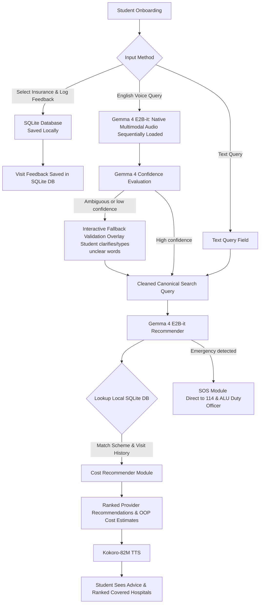

## 3.3 Data Definition and Acquisition

### 3.3.1 Local Insurance, Clinic, and Cost Dataset

The training dataset has five hundred entries. It is split into two parts.

The first part has three hundred entries. These entries contain standard insurance policies and provider networks for the 15 best hospitals. They only need formatting.

The second part has two hundred entries. These entries contain custom queries and past visit feedback logs. An insurance specialist will validate this part.

The dataset will not include any medical diagnoses, drug names, or medical device recommendations. The model will only handle clinic routing and network tiers.

A compliant entry is: I use Britam but my claim at Legacy Clinic was rejected. I need a general consultation. The model output is: Your Britam plan covers general consultation at Tier One clinics with a ten percent copay. Since Legacy Clinic is out-of-network, we recommend Baho Clinic or Kacyiru Hospital. Do not visit King Faisal Hospital without pre-authorization.

### 3.3.2 DPO Preference Dataset

We will collect two hundred preference pairs. We will check annotator agreement using Cohen's Kappa. If the score is below sixty hundredths, we will ask the specialist to review the pair.

The chosen response correctly parses clinic query categories, recommends the cheapest covered facility from the 15 best hospitals, alerts about past failures, and explains pre-authorization rules. The rejected response routes the user to an out-of-network hospital, hallucinates rules, or tries to diagnose symptoms.

### 3.3.3 Local Patient Interaction History and Visit Feedback Memory

An encrypted local SQLite database stores the comprehensive history of the user's interactions with the application. This interaction history consists of: (1) past recommendation searches and system-suggested providers, and (2) user-logged visit feedback records indicating whether the user visited a recommended clinic, whether their insurance scheme successfully covered the visit under their scheme rules (e.g. claim success or rejection), and the actual out-of-pocket costs incurred.

On a new hospital recommendation query, the system retrieves the user's settings and the 5 most recent app interaction and visit logs. It compiles this local context directly into the prompt context appended to the model prompt (see Section 3.5.4 for details). If the user's interaction history shows that a clinic previously rejected their insurance coverage or charged unexpected out-of-pocket fees, that specific clinic is flagged and de-ranked. This human-in-the-loop, on-device history tracking allows subsequent recommendations to dynamically adapt to the user's actual empirical usage patterns, preventing repeated navigation failures and out-of-pocket losses.

## 3.4 System Architecture

The Ranga system includes a cloud training pipeline and an on-device app.

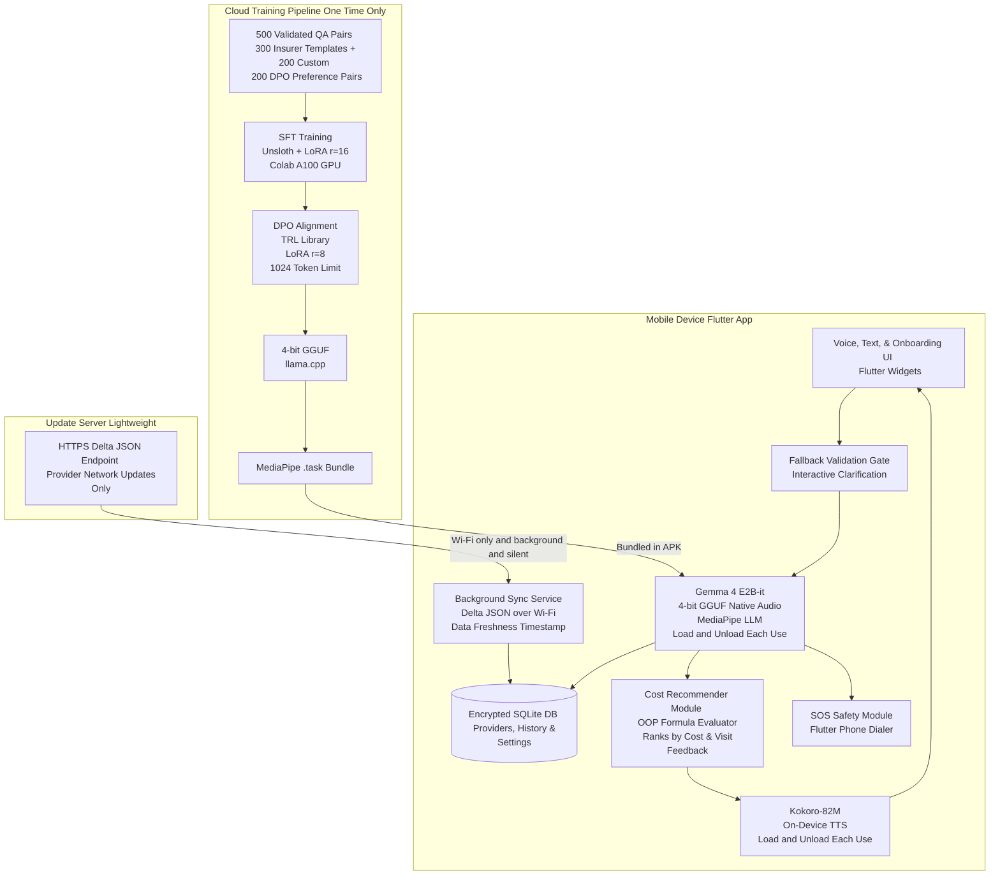

### 3.4.1 Sequential Model Loading Protocol

The app runs two models sequentially. It never runs them at the same time.

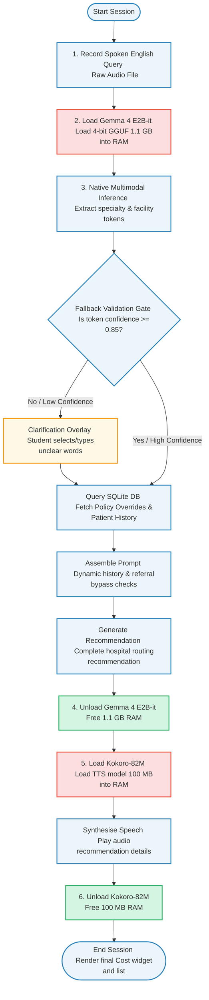

Peak memory stays under one and eighteen hundredths gigabytes. This is safe for a phone with four gigabytes of memory.

### 3.4.2 Offline-First Background Sync Architecture

The app updates its clinic database using four main rules.

First, the app uses a background sync service. When the phone connects to Wi-Fi, the app fetches a small JSON file with changed clinic records.

Second, the app applies the update inside a single SQLite transaction. If the download fails or the file is broken, the database rolls back to keep the old data safe.

Third, the app displays a yellow warning banner if the database is older than seven days. The warning recommends connecting to Wi-Fi to get the latest clinic list.

Fourth, the sync service protects privacy. It only transmits a random ID to prevent database spamming. It never shares personal information, past searches, or policy rules.

### 3.4.3 Administrative Updates Dashboard

We will build a web-based dashboard for administrators. This dashboard is hosted on a secure university server. The university staff will use this dashboard to manage clinics and insurance information. 

First, the dashboard allows staff to add new clinics or remove de-listed ones. Staff can enter the clinic name, physical address, GPS coordinates, and contact details. 

Second, staff can update insurance tier rules. For example, if a clinic changes from being in-network to out-of-network under Britam, the administrator can change this status on the screen. They can also update copayment percentages. 

Third, when the administrator clicks save, the dashboard updates the master database on the university server. The server automatically calculates the changes. It writes these changes into a lightweight JSON delta update file. 

Finally, this JSON file is what the mobile app's sync service downloads. This design keeps the mobile app updated without making students download a huge database file every time.

## 3.5 Machine Learning Pipeline

### 3.5.1 Full Training Pipeline

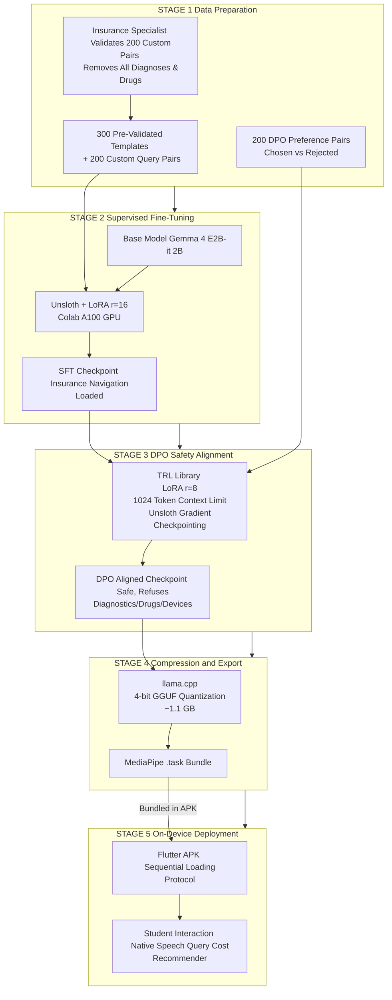

### 3.5.2 Session History Assembly and Prompt Construction

The app builds a search prompt locally on the phone using multiple data sources. This supports history-aware recommendations (answering Research Question Two). The process follows four steps.

First, the app fetches the user's insurance plan selection from the database.

Second, the app inspects the user's three most recent sessions. It checks if the user visited recommended clinics and if the insurance paid the bills.

Third, the app counts successful visits. If the user has two successful visits, or if they need specialized care, the app sets the bypass referral flag to true.

Fourth, the app compiles these details with a system prompt. The system prompt contains safety rules that forbid diagnosing illnesses. The final prompt contains the safety rules, user history, referral bypass status, active insurance plan, and spoken query.

We will compute the Cosine Similarity score after each session. If the history system works, it will lower the average similarity score by fifteen hundredths compared to the baseline.

### 3.5.3 Patient Interaction and Visit History Re-routing Logic

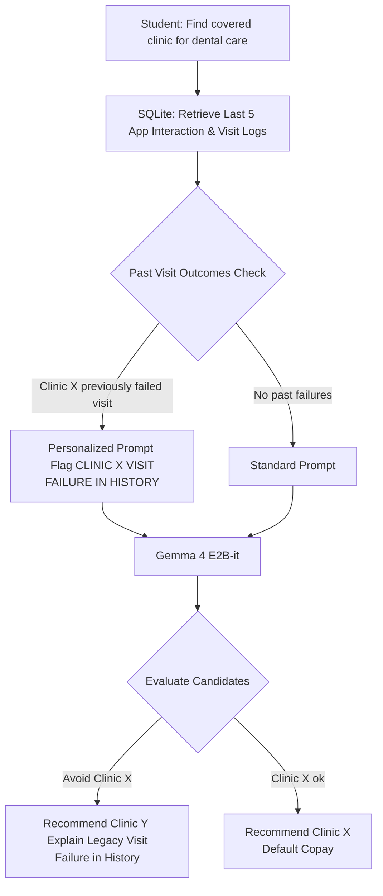

### 3.5.4 Evaluation Metrics and Success Criteria

| Metric | Measurement Method | Target |
|---|---|---|
| Specialty Classification Accuracy | % correctly classified queries into service levels vs. specialist labels | >=85% |
| Insurance Navigation Error Rate | % queries recommending an uncovered or wrong-tier facility | <=10% |
| DPO vs SFT Error Reduction | Chi-Square test (alpha=0.05) on navigation error counts | Statistically significant |
| Latency Per Query | Time from query input to output on Xiaomi Redmi 12 | <=10 seconds |
| Cosine Similarity Reduction (RQ2) | History vs. zero-history baseline on recurring query test set | Reduction >=0.15 |
| Gemma 4 Audio Accent Accuracy | % correct classification of facility and specialty tokens | >=80% |
| Peak RAM Usage | Android Profiler during maximum-load session | <=1.2 GB |
| Battery Drain | % battery per 10-minute session | <=3% |

## 3.6 UML Diagrams

### 3.6.1 Use Case Diagram

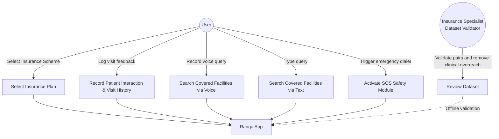

### 3.6.2 Class Diagram

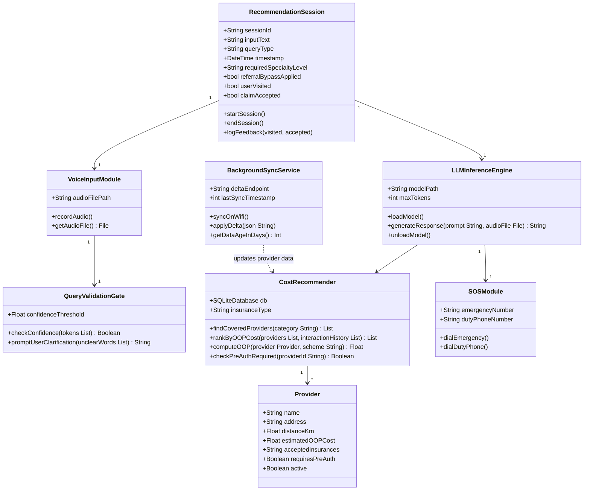

### 3.6.3 Entity Relationship Diagram

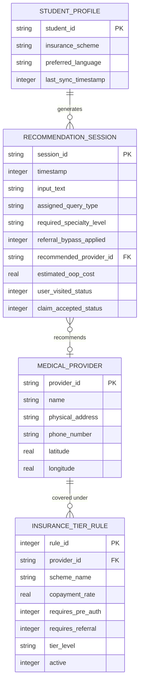

### 3.6.4 Sequence Diagram

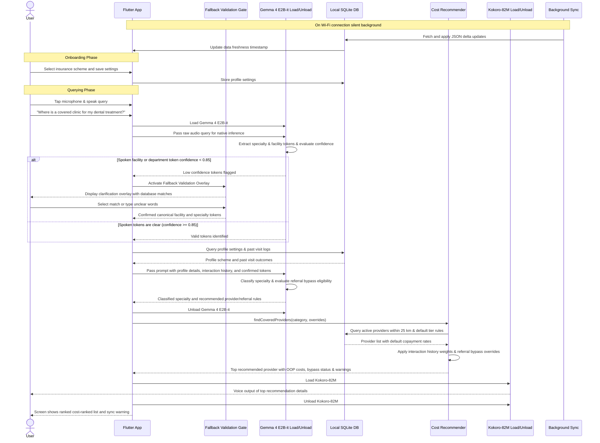

## 3.7 Development Tools

| Tool | Category | How It Is Used |
|---|---|---|
| Flutter 3.x | Mobile Framework | Cross-platform UI for Android and iOS |
| Dart | Programming Language | Mobile application logic |
| MediaPipe LLM | ML Runtime | Loads GGUF Gemma 4 E2B-it on-device via ARM |
| Fallback Validation Gate | NLP Utility | Prompts user clarification for ambiguous or low-confidence tokens |
| Kokoro-82M | TTS Engine | On-device text-to-speech, sequentially loaded |
| Gemma 4 E2B-it | Base AI Model | Core model fine-tuned for native speech query classification & hospital recommendation |
| Unsloth | ML Training | Memory-efficient SFT with gradient checkpointing |
| TRL Library | ML Training | DPO alignment training |
| llama.cpp | Quantization | 4-bit GGUF compression |
| SQLite | Local Database | Providers, app interaction & visit feedback logs, and settings |
| Google Colab A100 | Training Hardware | Cloud GPU for model training |
| GitHub | Version Control | Code storage and collaboration |
| Figma | Design Tool | UI/UX screen design |

## 3.8 Chapter Summary

This chapter described the design of Ranga. The project makes seven key engineering contributions. First, the validation gate fixes accent mistakes. Second, the sequential model loading protocol solves the phone memory problem. Third, the offline background sync service warns users when data is old. Fourth, the local database tracks rules and user history. Fifth, the history design helps answer Research Question Two. Sixth, the crossover test uses formal statistical methods. Finally, the app enforces strict safety rules to block drug naming and medical diagnoses.

---

# CHAPTER FOUR: PRIVACY AND ETHICAL CONSIDERATIONS

## 4.1 Overview

Managing user settings and health insurance profiles requires careful privacy protocols. We address consent, data protection, medical liability, and crisis redirects below.

## 4.2 Research Data Consent

The application does not collect voice recordings, biometric data, or personal details from users. The developer does not require institutional approvals since no human participant testing or recording occurs. However, the app includes a voluntary data sharing option. The app asks users for consent if they wish to share their anonymous search queries and clinic visit feedback logs to help improve the system. If the user agrees, the app uploads these logs securely. If the user declines, the data remains strictly on their mobile phone.

## 4.3 Data Protection, Privacy, and Android Keystore Security

Ranga keeps all data on the phone to protect user privacy. First, the app does not send sensitive data to the cloud. All insurance settings, search history, and clinic visit logs stay in the local database. If a user agrees to share their logs for research, the app uploads the data securely. Otherwise, all information remains local.

Second, the app encrypts the local database using AES-256 and the Android Keystore System. The phone generates a secure key when the app starts. The key is stored in a secure part of the phone's hardware. The key never appears in plain text in the app memory. Even if someone steals the phone, they cannot read the database file without the user's PIN or fingerprint.

Third, the database stores search history anonymously. The app does not save user names or phone numbers.

Fourth, users can delete their entire search history and profile settings inside the app settings screen at any time.

Fifth, this offline design complies with Rwanda's Data Protection Law (Law No. 058/2021). The background sync service only shares a random ID to check for clinic database updates, which prevents external tracking.

## 4.4 Medical Liability and the Strict Medical Boundary

Ranga is only an administrative helper. It does not diagnose illnesses, prescribe medicine, or recommend medical devices. The app shows a mandatory disclaimer screen at start-up to explain these limits. We enforce this boundary at three levels.

First, the dataset contains no clinical questions. It only has clinic and query classification details.

Second, we train the model using direct preference optimization to refuse clinical requests. The rejected responses include examples where the model tries to diagnose diseases, prescribe drugs, or recommend medical devices.

Third, the system prompt tells the Gemma model to focus only on hospital routing. Under Rwandan law, only licensed doctors can prescribe medicines or medical devices. Doing so without a license is illegal. This three-layer system protects the project and the users from liability risks.

## 4.5 Mental Health Crisis Protocol

Students or members of the public who are sad or in a mental health crisis might search for help. The app is not a therapist. It uses a strict protocol for crises.

First, any crisis-related input triggers an emergency rating.

Second, the app stops the clinic search. It shows a screen that asks the user to dial the national mental health helpline at 114.

Third, the app does not try to talk to the user or route them to a hospital. It gives a short, calm reply and directs them to a human helper.

Fourth, the preference dataset trains the model to decline advice for crisis queries and show the emergency screen instead.

---

## References

Aboye, G. T., Vande Walle, M., Simegn, G. L., & Aerts, J.-M. (2023). mHealth in sub-Saharan Africa and Europe: A systematic review comparing the use and availability of mHealth approaches. *DIGITAL HEALTH*, 9. https://doi.org/10.1177/20552076231180972

Artsi, Y., Sorin, V., Glicksberg, B. S., Korfiatis, P., Nadkarni, G. N., & Klang, E. (2025). Large language models in real-world clinical workflows: A systematic review. *Frontiers in Digital Health*, 7, 1659134. https://doi.org/10.3389/fdgth.2025.1659134

Bene, B. A., Ibeneme, S., Fadahunsi, K. P., Harri, B. I., Ukor, N., Mastellos, N., Majeed, A., & Car, J. (2024). Regulatory standards and guidance for the use of health apps for self-management in Sub-Saharan Africa: Scoping review. *Journal of Medical Internet Research*, 26, e49163. https://doi.org/10.2196/49163

Betjeman, T. J., Soghoian, S. E., & Foran, M. P. (2013). mHealth in Sub-Saharan Africa. *International Journal of Telemedicine and e-Health*, 19(4), 252-258. https://doi.org/10.1155/2013/482324

Braun, V., & Clarke, V. (2006). Using thematic analysis in psychology. *Qualitative Research in Psychology*, 3(2), 77-101. https://doi.org/10.1191/1478088706qp063oa

Britam Rwanda. (2025). *Milele Corporate and Ramba na Britam medical coverages*. Britam Insurance Company (Rwanda) Ltd. https://www.britam.com/rw

Eden Care Medical. (2026). *Digital health insurance plans for SMEs and corporates in Rwanda*. Eden Care Medical Insurance. https://www.edencaremedical.com

Google DeepMind. (2026a). *Gemma 4 model overview*. Google AI for Developers. https://ai.google.dev/gemma

Google DeepMind. (2026b). *Gemma 4: Technical report*. Google DeepMind. https://deepmind.google/models/gemma

Habimana, L., Bazzett-Matabele, L., Hebert, K., Fillion, G., Rulisa, S., & Goodman, A. (2022). Does community-based health insurance protect women from financial catastrophe after cesarean section? *BMC Pregnancy and Childbirth*, 22, 419. https://doi.org/10.1186/s12884-022-04748-4

Hexgrad. (2025). *Kokoro-82M: Open-weight text-to-speech model*. Hugging Face. https://huggingface.co/hexgrad/Kokoro-82M

Holden, R. J., & Karsh, B.-T. (2010). The Technology Acceptance Model: Its past and its future in health care. *Journal of Biomedical Informatics*, 43(1), 159-172. https://doi.org/10.1016/j.jbi.2009.07.002

Idowu, T., Adebiyi, M. O., & Oladele, T. O. (2023). *Machine learning recommendation system for health insurance decision making in Nigeria*. arXiv preprint arXiv:2305.10708. https://arxiv.org/abs/2305.10708

International Development Research Centre. (2023). *Community-based health insurance and out-of-pocket spending in Rwanda*. IZA Discussion Papers. https://www.iza.org/publications/dp/16281/

Kim, J., Lee, S., & Park, H. (2026). *Pocket RAG: On-device RAG for first aid guidance in offline mobile environments*. arXiv preprint arXiv:2601.12345.

Koenecke, A., Nam, A., Lake, E., Nudell, J., Quartey, M., Mengesha, Z., Toups, C., Rickford, J. R., Jurafsky, D., & Goel, S. (2020). Racial disparities in automated speech recognition. *Proceedings of the National Academy of Sciences*, 117(14), 7684-7689. https://doi.org/10.1073/pnas.1915768117

Liao, P., Zhang, X., & Chen, Y. (2026). Independent and collaborative performance of large language models and healthcare professionals in diagnosis and triage. *npj Digital Medicine*, 9, 47. https://doi.org/10.1038/s41746-026-02409-8

Masanneck, L., Schmidt, L., Seifert, A., Kolsche, T., Huntemann, N., Jansen, R., Mehsin, M., Bernhard, M., Meuth, S. G., Bohm, L., & Pawlitzki, M. (2024). Triage performance across large language models, ChatGPT, and untrained doctors in emergency medicine: Comparative study. *Journal of Medical Internet Research*, 26, e53297. https://doi.org/10.2196/53297

Muremyi, R., Haughton, D., Niragire, F., & Kabano, I. (2023). A cross-sectional analysis of the impact of health insurance on the use of health care in Rwanda. *Heliyon*, 9(6), e16801. https://doi.org/10.1016/j.heliyon.2023.e16801

National Commission for the Protection of Human Subjects. (1979). *The Belmont Report*. U.S. Department of Health, Education, and Welfare.

Nissen, L., Mussallem, P., Ravi, V., & Zahedivash, A. (2025). *Medicine on the edge: Comparative performance analysis of on-device LLMs for clinical reasoning*. arXiv preprint arXiv:2502.08954.

Nong, P., Adler-Milstein, J., Apathy, N. C., Holmgren, A. J., & Everson, J. (2025). Current use and evaluation of artificial intelligence and predictive models in US hospitals. *Health Affairs*, 44(1), 90-98. https://doi.org/10.1377/hlthaff.2024.00887

Nyandekwe, M., Nzayirambaho, M., & Kakoma, J. B. (2020). Universal health insurance in Rwanda: Major challenges and solutions for financial sustainability. *Pan African Medical Journal*, 37(55). https://doi.org/10.11604/pamj.2020.37.55.20248

Obermeyer, Z., & Obermeyer, S. (2019). Dissecting racial bias in an algorithm used to manage the health of populations. *Science*, 366(6464), 447-453. https://doi.org/10.1126/science.aax2342

Rafailov, R., Sharma, A., Mitchell, E., Manning, C. D., Ermon, S., & Finn, C. (2024). Direct preference optimization: Your language model is secretly a reward model. *arXiv preprint arXiv:2305.18290*. https://arxiv.org/abs/2305.18290

Rosenstock, I. M. (1974). Historical origins of the health belief model. *Health Education Monographs*, 2(4), 328-335. https://doi.org/10.1177/109019817400200403

Rwanda Ministry of Health. (2020). *Integrated national health sector referral guidelines*. Ministry of Health, Republic of Rwanda. https://www.moh.gov.rw

Rwanda Social Security Board. (2026a). *Medical scheme guidelines and partner networks*. RSSB. https://www.rssb.rw/scheme/medical-scheme

Rwanda Social Security Board. (2026b). *Community-Based Health Insurance (CBHI) scheme operations*. RSSB. https://www.rssb.rw/scheme/cbhi-scheme

Savage, T., Ma, S. P., Boukil, A., Rangan, E., Patel, V., Lopez, I., & Chen, J. (2025). Fine-tuning methods for large language models in clinical medicine by supervised fine-tuning and direct preference optimization: Comparative evaluation. *Journal of Medical Internet Research*, 27, e76048. https://doi.org/10.2196/76048

Spandorfer, R., Hajek, P., Muller, T., & Jansen, R. (2024). Ethical implications of AI-driven clinical decision support systems on healthcare resource allocation. *BMC Medical Ethics*, 25, 148. https://doi.org/10.12910/024-01151-8

Ssengooba, F., Tashobya, C. K., Tomson, G., Mugisha, F., & Pariyo, G. (2022). Strengths and weaknesses of strategic health purchasing for universal health coverage in Rwanda. *Global Health: Science and Practice*, 10(3), e2061891. https://doi.org/10.9745/GHSP-D-21-00422

Venkatesh, V., Morris, M. G., Davis, G. B., & Davis, F. D. (2003). User acceptance of information technology: Toward a unified view. *MIS Quarterly*, 27(3), 425-478. https://doi.org/10.2307/30036540

Wei, X., Zhou, P., & Wang, Z. (2025). *MoPHES: Leveraging on-device LLMs as agent for mobile psychological health evaluation and support*. arXiv preprint arXiv:2510.04561.

World Health Organization. (2022). *World mental health report: Transforming mental health for all*. WHO Press. https://www.who.int/publications/i/item/9789240049338

Zou, Y., Wang, T., & Chen, H. (2026). *Toward zero-egress psychiatric AI: On-device LLM deployment for privacy-preserving mental health decision support*. arXiv preprint.