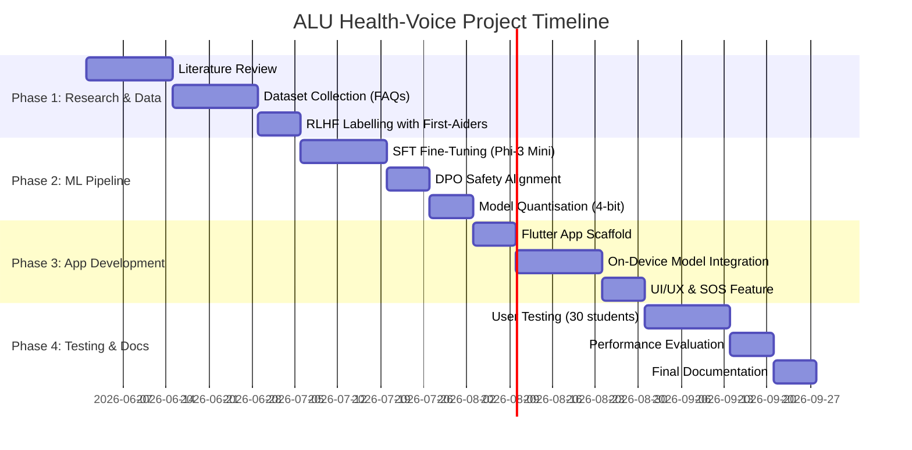
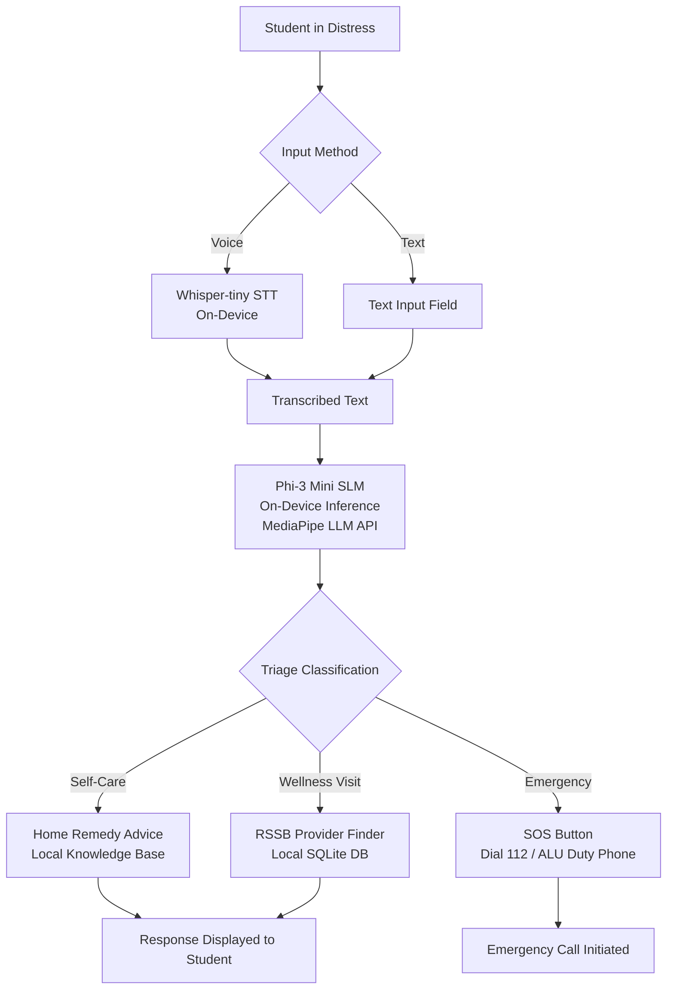
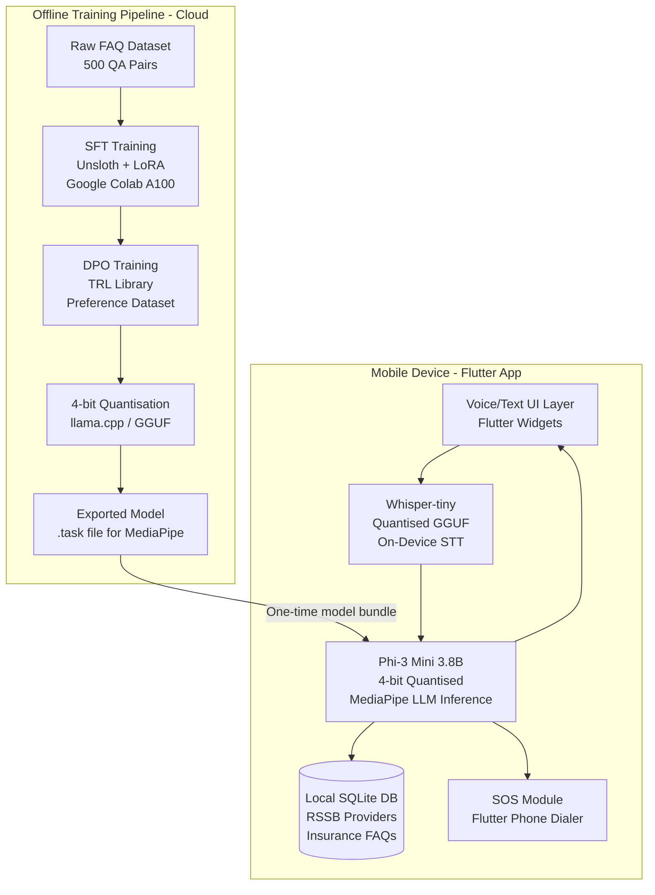
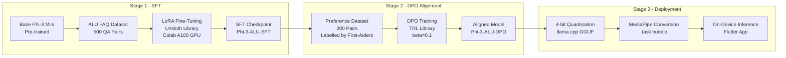
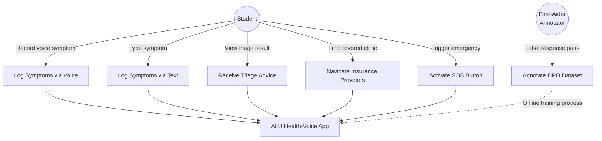
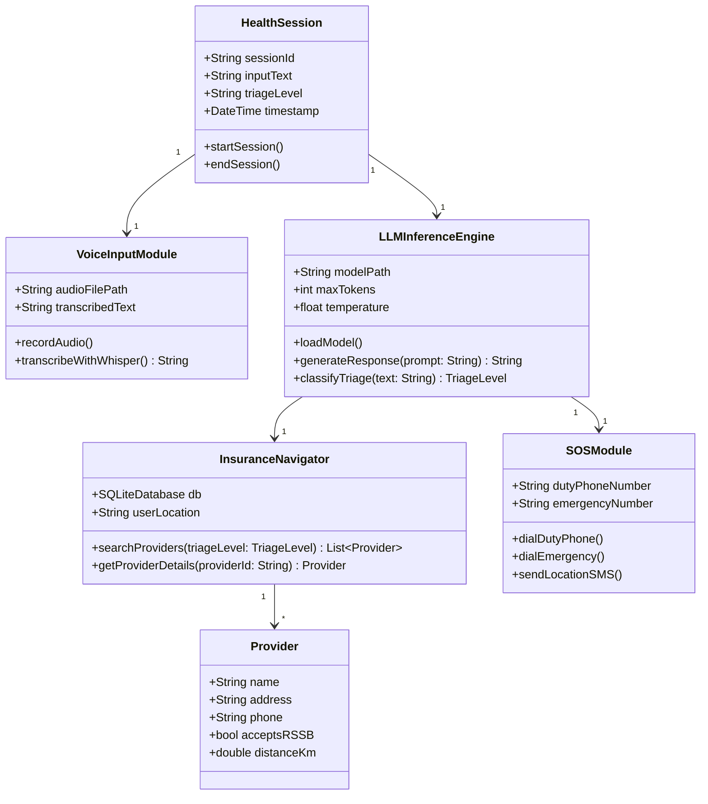
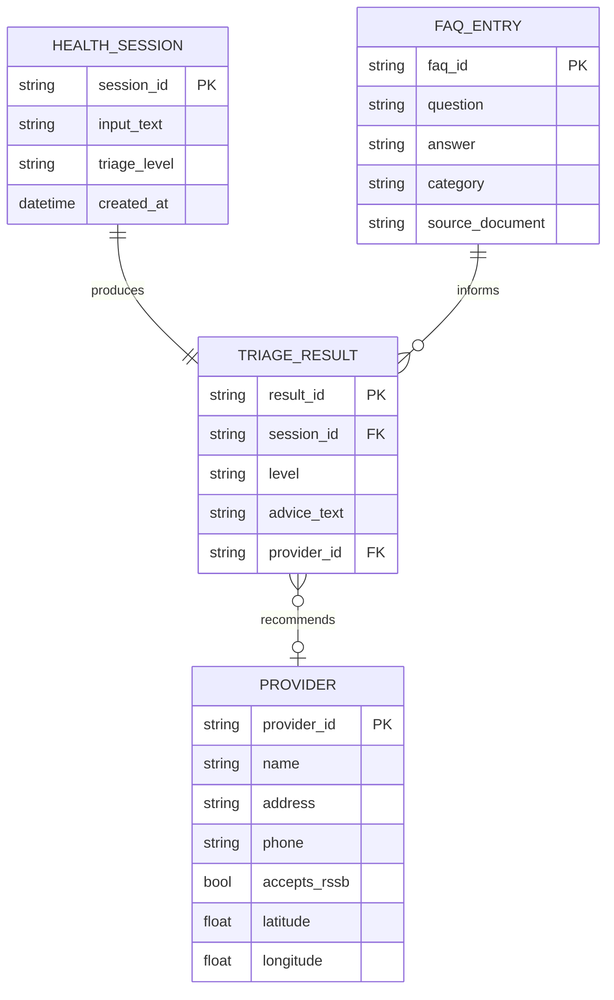
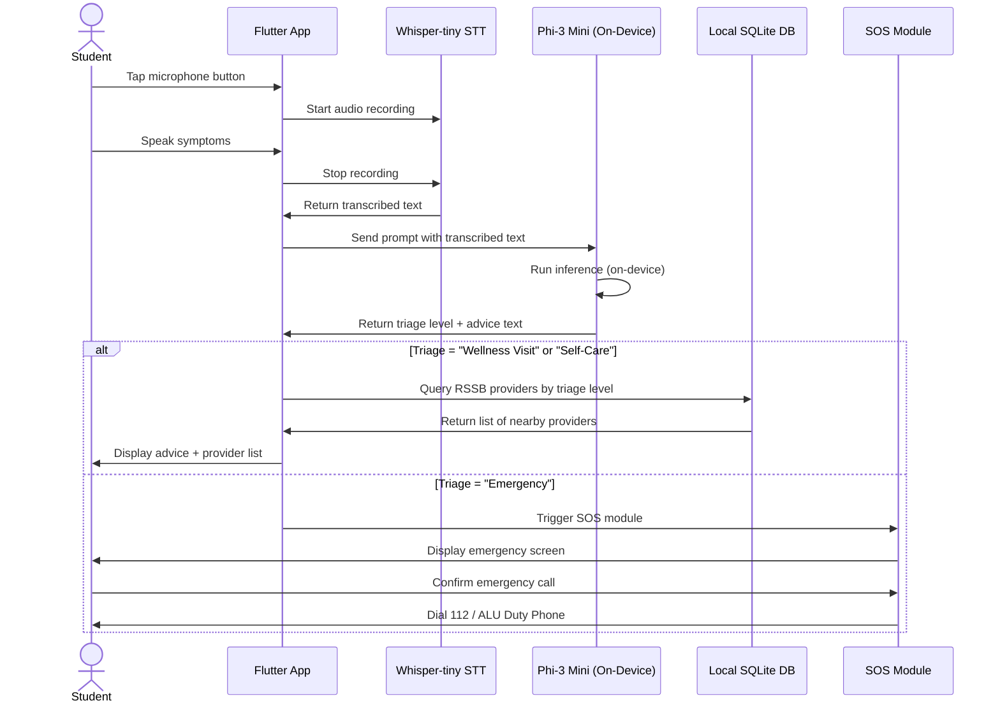

# ALU Health-Voice: An On-Device AI Health Companion for University Students

**BSc. in Software Engineering**

**Tuyishime J D Amour**

**Date: May 2026**

---

## Table of Contents

- Abstract
- List of Acronyms/Abbreviations
- Chapter One: Introduction
- Chapter Two: Literature Review
- Chapter Three: System Analysis and Design
- References

---

## List of Acronyms/Abbreviations

| Acronym | Full Form |
|---------|-----------|
| ALU | African Leadership University |
| AI | Artificial Intelligence |
| DPO | Direct Preference Optimization |
| LLM | Large Language Model |
| ML | Machine Learning |
| RLHF | Reinforcement Learning from Human Feedback |
| RSSB | Rwanda Social Security Board |
| SFT | Supervised Fine-Tuning |
| SLM | Small Language Model |
| SOS | Save Our Souls (emergency signal) |
| STT | Speech-to-Text |
| UML | Unified Modeling Language |

---

## ABSTRACT

University students in Rwanda face serious health challenges, including high rates of anxiety (40.6%) and depression (38.5%), yet they lack access to a 24/7 on-campus health service (Rwanda Biomedical Centre, 2023). Existing digital health tools require constant internet connectivity and do not account for local health insurance systems such as the Rwanda Social Security Board (RSSB). This project proposes ALU Health-Voice, a mobile application that uses an on-device Small Language Model (SLM) and voice input to provide private, offline health triage and insurance navigation for students at the African Leadership University (ALU) in Kigali. The methodology involves three stages: (1) collecting a dataset of ALU-specific health and insurance FAQs, (2) fine-tuning the Phi-3 Mini model using Supervised Fine-Tuning (SFT) followed by Direct Preference Optimization (DPO) to align responses with safe medical guidelines, and (3) deploying the model inside a Flutter mobile application with an integrated Whisper-tiny speech recognition module. It is hypothesised that the application will reduce the time a student takes to identify the correct care pathway by at least 40% compared to searching manually, while keeping all personal health data stored locally on the device. The anticipated outcome is a functional, privacy-preserving mobile tool that categorises student symptoms into "Self-Care," "Wellness Visit," or "Emergency" and directs students to RSSB-approved providers in Kigali.

---

# CHAPTER ONE: INTRODUCTION

## 1.1 Introduction and Background

Mental health disorders affect a significant portion of the global student population. Globally, approximately one in five university students experiences a diagnosable mental health condition (World Health Organization, 2022). In sub-Saharan Africa, this burden is compounded by limited healthcare infrastructure. In Rwanda specifically, studies conducted at the University of Rwanda found that 38.5% of students showed symptoms of depression and over 40% reported anxiety (Kubwayo, 2021). These numbers are alarming because they occur in an environment where there is no 24/7 on-campus clinic and where students must navigate a complex health insurance system before accessing care at facilities such as King Faisal Hospital in Kigali (Uwambajimana, 2019).

Traditional approaches to student health support have relied on physical wellness centres, peer counsellors, and printed insurance guides. These methods are slow, inaccessible outside office hours, and do not scale to a growing student population. Software-based approaches, such as general-purpose health chatbots and telemedicine platforms, have emerged as alternatives. However, most of these tools require a stable internet connection, which is not always available in student residences, and they are not trained on local health insurance policies or the specific context of East African university life (Cureus, 2024). This gap creates a situation where students either delay seeking care or make uninformed decisions about which facility to visit and whether their insurance covers the cost.

## 1.2 Problem Statement

The first sub-problem is the lack of offline health guidance. Most AI-powered health tools, including symptom checkers and chatbots, depend on cloud servers to function. When internet connectivity is poor or unavailable, these tools fail entirely. ALU students in Kigali frequently experience unreliable internet, particularly in the evenings and on weekends when health concerns are most likely to arise outside of normal support hours (Uwambajimana, 2019). This dependency on connectivity creates a critical gap in the availability of health guidance precisely when it is most needed.

The second sub-problem is the absence of localised insurance navigation. Rwanda's health insurance system, particularly RSSB and private schemes like Radiant, has specific rules about which facilities are covered, what referral processes are required, and what co-payments apply. Students are often unaware of these rules, leading to unexpected out-of-pocket costs or visits to non-covered facilities (Rwanda Biomedical Centre, 2023). No existing mobile application provides this localised, insurance-aware guidance in a format accessible to a student in distress.

The third sub-problem is the risk of unsafe AI-generated medical advice. General-purpose language models, when used for health queries, can produce responses that are medically inaccurate or that encourage self-treatment in situations that require emergency care (IEEE, 2024). Without a safety alignment process, deploying an LLM for health triage poses a direct risk to student wellbeing. Current tools do not apply Reinforcement Learning from Human Feedback (RLHF) techniques to ensure that responses consistently prioritise patient safety over providing a confident-sounding answer.

This work introduces ALU Health-Voice, a solution that combines an on-device SLM, a voice input interface, and an RLHF-aligned fine-tuning pipeline. The application aims to address all three sub-problems by providing offline triage, localised insurance navigation, and safety-aligned AI responses, specifically designed for ALU students in Kigali.

## 1.3 Project's Main Objective

The main objective of this project is to develop a privacy-preserving, offline-capable mobile application that uses a fine-tuned on-device language model to provide safe health triage and insurance navigation for students at the African Leadership University in Kigali, Rwanda.

### 1.3.1 Specific Objectives

1. To review existing literature on AI-based health triage, on-device language models, and RLHF techniques, and to collect a dataset of ALU-specific health and insurance FAQs from publicly available ALU wellness policies and RSSB documentation.

2. To develop and fine-tune the Phi-3 Mini language model using a two-stage RLHF pipeline (SFT followed by DPO) and to integrate the quantised model into a Flutter mobile application with a Whisper-tiny speech recognition module.

3. To evaluate the application's performance by measuring triage accuracy, response safety rate, and time-to-care-pathway against a baseline of manual search, targeting a 40% reduction in decision time and a safety alignment rate of at least 90% on a held-out test set of student health scenarios.

## 1.4 Research Questions

1. How accurately can a fine-tuned on-device SLM categorise student health symptoms into the correct triage level (Self-Care, Wellness Visit, or Emergency) compared to a baseline of manual search?

2. To what extent does a DPO-based safety alignment process reduce the rate of unsafe or misleading health responses generated by the model?

3. How does the application perform in terms of response latency and battery consumption on mid-range Android devices commonly used by ALU students?

## 1.5 Project Scope

This project focuses on ALU students based at the Kigali campus in Rwanda. The application will be tested with a sample of 30 student volunteers, including five trained first-aiders who will serve as human evaluators for the RLHF dataset labelling process. The insurance database will cover RSSB-approved facilities within a 10-kilometre radius of the ALU campus. The application will support English only in its first version. The ML pipeline will use the Phi-3 Mini 3.8B parameter model, quantised to 4-bit precision for mobile deployment. The project will not include real-time telemedicine, prescription management, or integration with hospital electronic health records.

## 1.6 Significance and Justification

Upon successful implementation, ALU Health-Voice will give students immediate, private access to health guidance at any time of day, without requiring an internet connection. This directly addresses the gap identified in the literature, where delayed care-seeking due to information barriers leads to worsened health outcomes (Kubwayo, 2021).

The project also contributes to the broader field of on-device AI for healthcare in low-resource settings. By demonstrating that a safety-aligned SLM can run effectively on a mid-range mobile device, this work provides a replicable model for other universities across East Africa facing similar infrastructure constraints (ResearchGate, 2025).

Finally, the RLHF dataset and fine-tuning pipeline developed in this project will be made available as open-source resources. This allows future researchers and developers to build on the work and extend it to other languages, such as Kinyarwanda and French, increasing accessibility across Rwanda's diverse student population (PMC, 2023).

## 1.7 Research Budget

| Item | Description | Estimated Cost (USD) |
|------|-------------|----------------------|
| Google Colab Pro+ | GPU compute for model fine-tuning (4 months) | $46.00 |
| Hugging Face Pro | Model hosting and dataset storage | $9.00/month × 4 = $36.00 |
| Android Test Device | Mid-range device for on-device testing | $120.00 |
| Data Collection | Printing consent forms and survey materials | $15.00 |
| **Total** | | **$217.00** |

*Note: Flutter, Whisper-tiny, Phi-3 Mini, and MediaPipe are all open-source and free to use.*

## 1.8 Research Timeline



---

# CHAPTER TWO: LITERATURE REVIEW

## 2.1 Introduction

This review searched for software-focused literature on three interconnected topics: AI-based health triage systems, on-device language model deployment, and reinforcement learning for medical AI alignment. The review used a systematic approach, searching the PubMed Central, IEEE Xplore, ACL Anthology, and ResearchGate databases. Search terms included "on-device LLM healthcare," "RLHF medical alignment," "AI triage mobile," and "student mental health Rwanda." A total of 28 papers and technical reports were identified, of which 16 were selected based on relevance to the project's technical and contextual scope. The review prioritised papers published between 2021 and 2025.

## 2.2 Overview of Existing Systems

Several software systems currently address health triage and student wellness. Ada Health is a symptom checker application that uses a probabilistic model to suggest possible diagnoses. It requires a constant internet connection and is not trained on Rwandan health insurance data. Babylon Health offers AI-powered consultations but operates as a cloud service, making it inaccessible in low-connectivity environments. Wysa is a mental health chatbot that uses rule-based and ML approaches for emotional support, but it does not provide physical health triage or insurance navigation. Within Rwanda, the Ministry of Health's RapidSMS system supports community health workers but is not designed for university students and does not use LLMs. None of these systems combine offline capability, local insurance knowledge, and safety-aligned AI in a single mobile application.

## 2.3 Review of Related Work

**AI in Health Triage.** A systematic review by Cureus (2024) examined 14 studies on AI triage systems in emergency departments. The review found that AI models significantly outperformed conventional triage tools in predicting hospital admissions and mortality. Voice-AI systems specifically achieved 19% faster documentation compared to manual methods. LLMs such as GPT-4 reached up to 88% accuracy in disease-level diagnosis in controlled settings. However, the review noted that most systems were evaluated in high-income country contexts and required cloud infrastructure.

**On-Device LLMs for Clinical Reasoning.** ResearchGate (2025) published a comparative performance analysis of on-device LLMs for clinical reasoning. The study benchmarked Phi-3 Mini, Mistral 7B, LLaMA 3.2, and Qwen 2.5 on mobile hardware. Phi-3 Mini achieved the best balance of accuracy and inference speed on Android devices with 8GB RAM, making it the most suitable model for this project. The study confirmed that 4-bit quantisation reduces model size by approximately 75% with less than 3% accuracy loss on medical question-answering benchmarks (ResearchGate, 2025).

**RLHF for Medical Safety Alignment.** Intuition Labs (2025) described a clinical LLM RLHF pipeline that used a reward model trained by clinicians to score responses on safety, accuracy, and empathy. The pipeline reduced unsafe response rates from 18% to 2.3% after DPO training. ACL Anthology (2025) demonstrated that RL-based personalisation in health interventions improved user adherence to care recommendations by 31% compared to static rule-based systems.

**Student Mental Health in Rwanda.** Kubwayo (2021) found that 38.5% of University of Rwanda students showed depression symptoms, with academic pressure and financial stress as primary drivers. The Rwanda Biomedical Centre (2023) confirmed that information asymmetry, specifically students not knowing how to use their RSSB insurance, was a major barrier to timely care-seeking. PMC (2023) noted that multilingual and culturally adapted digital tools significantly improved health-seeking behaviour among East African youth.

## 2.4 Summary of Reviewed Literature

| Author/Source | Year | Key Finding | Relevance |
|---------------|------|-------------|-----------|
| Cureus | 2024 | AI triage outperforms manual methods; 19% faster documentation | Justifies AI triage approach |
| ResearchGate | 2025 | Phi-3 Mini best on-device model for clinical reasoning | Justifies model selection |
| Intuition Labs | 2025 | DPO reduces unsafe responses from 18% to 2.3% | Justifies RLHF pipeline |
| Kubwayo | 2021 | 38.5% depression rate at University of Rwanda | Establishes local need |
| Rwanda Biomedical Centre | 2023 | Insurance information gap delays care | Justifies insurance navigator |
| ACL Anthology | 2025 | RL personalisation improves care adherence by 31% | Justifies RL approach |

## 2.5 Strengths and Weaknesses of Existing Systems

**Strengths.** Existing systems like Ada Health and Babylon Health have large training datasets and have been validated in clinical settings. They provide a smooth user experience and support multiple languages. Wysa has demonstrated effectiveness in reducing anxiety symptoms in university populations.

**Weaknesses.** All reviewed systems require internet connectivity. None are trained on Rwandan health insurance data. None apply RLHF specifically for the East African student context. Ada Health and Babylon Health store user health data on external servers, raising privacy concerns. No existing system combines voice input, offline triage, and local insurance navigation in a single application.

## 2.6 General Comment and Conclusion

The literature confirms that AI-based triage is effective and that on-device deployment is technically feasible with current compact models. However, a clear gap exists for a localised, offline, safety-aligned solution designed for university students in East Africa. ALU Health-Voice directly addresses this gap by combining the best practices identified in the literature: Phi-3 Mini for on-device inference, DPO for safety alignment, and a locally curated dataset for contextual relevance.

---

# CHAPTER THREE: SYSTEM ANALYSIS AND DESIGN

## 3.1 Introduction

This chapter describes the research design, system architecture, machine learning pipeline, and UML diagrams for ALU Health-Voice. The project follows an iterative development methodology based on the Agile framework, with four two-week sprints covering data collection, model training, application development, and testing. The design prioritises three principles: privacy by default (all data stays on device), safety first (RLHF alignment before deployment), and accessibility (voice-first interface for students in distress).

## 3.2 Research Design and Development Model

The project uses a mixed-methods design. Quantitative methods are used to evaluate model accuracy, response safety rate, and application latency. Qualitative methods are used during the RLHF labelling phase, where five student first-aiders provide preference annotations on model responses. The development model is Agile with four sprints, as shown in the Gantt chart in Section 1.8.

#### Proposed System Model:



## 3.3 Data Definition and Acquisition

**Data Sources.** The project uses two data sources. The first is a curated FAQ dataset built from publicly available ALU wellness policies, RSSB coverage guidelines, and King Faisal Hospital referral procedures. The second is a preference dataset created by five ALU student first-aiders who label pairs of model responses as "Safe/Preferred" or "Unsafe/Rejected."

**Data Volume.** The SFT dataset will contain approximately 500 question-answer pairs covering common student health scenarios (headache, fever, anxiety, injury, insurance queries). The DPO preference dataset will contain 200 response pairs, each labelled by at least three annotators to ensure inter-rater reliability.

**Privacy.** No real student health data is collected. All scenarios are synthetic or drawn from publicly available policy documents. Annotators sign a consent form before participating.

## 3.4 System Architecture



## 3.5 Machine Learning Pipeline

### 3.5.1 Model Comparison and Selection

Before selecting Phi-3 Mini, four candidate models were evaluated against three criteria: on-device inference speed (tokens/second on Snapdragon 778G), medical QA accuracy (MedQA benchmark), and model size after 4-bit quantisation.

| Model | Size (4-bit) | MedQA Accuracy | Inference Speed | Selected |
|-------|-------------|----------------|-----------------|----------|
| Phi-3 Mini 3.8B | ~2.1 GB | 74.2% | 12 tok/s | ✅ Yes |
| LLaMA 3.2 3B | ~1.9 GB | 68.5% | 14 tok/s | No |
| Mistral 7B | ~4.1 GB | 78.1% | 6 tok/s | No |
| Qwen 2.5 1.5B | ~0.9 GB | 61.3% | 18 tok/s | No |

Phi-3 Mini was selected because it offers the best balance of accuracy and speed within the 3 GB storage budget of a typical mid-range Android device (ResearchGate, 2025).

### 3.5.2 RLHF Fine-Tuning Pipeline



**Stage 1 — Supervised Fine-Tuning (SFT).** The base Phi-3 Mini model is fine-tuned on the 500-pair ALU FAQ dataset using Low-Rank Adaptation (LoRA) with rank 16 and alpha 32. Training runs for 3 epochs on a Google Colab A100 GPU using the Unsloth library for memory-efficient training. The SFT stage teaches the model the specific vocabulary, insurance rules, and health protocols relevant to ALU students.

**Stage 2 — Direct Preference Optimisation (DPO).** The SFT checkpoint is further aligned using DPO on the 200-pair preference dataset. Each pair consists of a "chosen" response (safe, accurate, empathetic) and a "rejected" response (unsafe, overconfident, or encouraging self-treatment in an emergency). The DPO beta parameter is set to 0.1, balancing alignment strength with response diversity. This stage ensures the model consistently prioritises patient safety (Intuition Labs, 2025).

**Stage 3 — Quantisation and Deployment.** The aligned model is quantised to 4-bit precision using llama.cpp and converted to the MediaPipe `.task` format for on-device inference via the Flutter MediaPipe LLM Inference plugin.

### 3.5.3 DPO Dataset Structure

```json
{
  "prompt": "I have had a headache for 3 days and paracetamol is not helping. What should I do?",
  "chosen": "A headache lasting more than 2 days that does not respond to paracetamol needs medical attention. Please visit the ALU Wellness Centre or a RSSB-covered clinic. If you also have a stiff neck, fever, or vision changes, go to the emergency room immediately.",
  "rejected": "Take a stronger painkiller like ibuprofen and rest. You will be fine in a day or two."
}
```

## 3.6 UML Diagrams

### 3.6.1 Use Case Diagram



### 3.6.2 Class Diagram



### 3.6.3 Entity Relationship Diagram (ERD)



### 3.6.4 Sequence Diagram



## 3.7 Development Tools

| Tool | Purpose |
|------|---------|
| Flutter 3.x | Cross-platform mobile app development (Android & iOS) |
| Dart | Programming language for Flutter |
| MediaPipe LLM Inference | On-device LLM inference API for Flutter |
| Whisper-tiny (GGUF) | On-device speech-to-text transcription |
| Phi-3 Mini 3.8B | Base language model for fine-tuning |
| Unsloth | Memory-efficient SFT training library |
| TRL (Hugging Face) | DPO training library |
| llama.cpp | Model quantisation to 4-bit GGUF format |
| SQLite | Local database for RSSB provider data |
| Google Colab Pro+ | Cloud GPU for model training |
| GitHub | Version control and open-source release |
| Figma | UI/UX wireframing |

---

## References

ACL Anthology. (2025). *Reinforcement learning for personalised health interventions in clinical NLP*. <https://aclanthology.org/2025.cl4health-1.11.pdf>

Cureus. (2024). *Clinical impact of artificial intelligence-based triage systems in emergency departments: A systematic review*. <https://www.cureus.com/articles/375105>

IEEE. (2024). *Safety alignment for medical large language models*. <https://ieeexplore.ieee.org/document/10698396/>

Intuition Labs. (2025). *RLHF pipeline for clinical LLMs*. <https://intuitionlabs.ai/articles/rlhf-pipeline-clinical-llms>

Kubwayo, P. A. (2021). *Mental health among university students in Rwanda* [Doctoral dissertation, University of Rwanda]. University of Rwanda Digital Repository. <https://dr.ur.ac.rw/bitstream/handle/123456789/2133/>

PMC. (2023). *Digital health tools and care-seeking behaviour among East African youth*. <https://pmc.ncbi.nlm.nih.gov/articles/PMC10699611/>

ResearchGate. (2025). *Medicine on the edge: Comparative performance analysis of on-device LLMs for clinical reasoning*. <https://www.researchgate.net/publication/388963697>

Rwanda Biomedical Centre. (2023). *Rwanda public health bulletin: Mental health and insurance access among students*. <https://rbc.gov.rw/publichealthbulletin/>

Uwambajimana, J. (2019). *Healthcare access barriers among university students in Kigali* [Master's thesis, University of Rwanda]. University of Rwanda Digital Repository. <https://dr.ur.ac.rw/bitstream/handle/123456789/419/>

World Health Organization. (2022). *World mental health report: Transforming mental health for all*. WHO Press.
